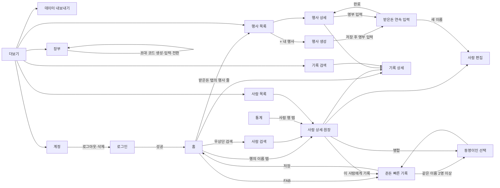

# 뿌린대로거두리라 — 1단계 PRD (준돈/받은돈 장부)

> 작성일 2026-09-14 · 작성 product-planner · 검토·보완 cto-orchestrator · 2026-09-15 클라우드 확정 반영 · **2026-09-16 공동 장부·로그인 3종·로그인 우선·Supabase 확정 반영**
> 상위 전제 — docs/01(핵심 가치 3개·로드맵), docs/04(Expo·클라우드·Supabase 확정, 로그인 Apple+Google+메일). 데이터 스키마는 docs/03(소유 축 = 장부)에 있다.

## ✅ CTO 결정 사항 (2026-09-14 검토)

product-planner가 올린 확인 요청 5건은 모두 기본안을 승인했다. 스키마 차원의 CTO 추가 결정 2건(`entries.direction` 제거, `events.host_person_id` 추가)은 docs/03 상단에 있으며, 이 문서에는 그 결과가 반영돼 있다.

| # | 항목 | 결정 | 근거 |
|---|---|---|---|
| 1 | 공동 부조(부부 한 봉투)의 표현 | 기록 1건에 대표자 `person_id` + 공동 부조자 `co_person_id` 1명. 두 사람의 원장에 모두 전액 표시 + "공동" 배지 **승인** | 봉투에 이름이 3명 이상 적히는 경우는 드물고, 부부는 경조사에서 한 단위로 취급된다. 분할은 "이 집이 10만원 냈다"는 실제 감각과 어긋난다. 최종 표시 방식은 사용자 확인 질문 5번 |
| 2 | 미확정 금액의 표현 | `amount` NULL = 미확정, 0원 = "부조 없음" **승인** | NULL은 SUM에서 자동 제외되고 "미확정 N건"으로 따로 센다. 플래그 방식은 0원과 미확정의 SUM 처리가 같아져 헷갈린다 |
| 3 | 내 행사의 당사자 측 구분 개수 | 2개 고정(`side_a_label`, `side_b_label`) **승인** | 결혼식이 압도적 다수이고 상주 3인 이상은 메모로 충분하다. 2단계 청첩장도 신랑·신부 2측 구조다 |
| 4 | 사람 삭제 시 기록 처리 | 경고 후 기록까지 함께 삭제, 같은 다이얼로그에서 병합 제안 **승인** | 사람 삭제의 대부분은 오타·중복 정리이며 그 해법은 병합이다. 차단만 하면 사용자가 기록을 일일이 지워야 한다 |
| 5 | 대리 부조(A가 B 돈을 대신 전달) | 스키마 없이 메모 처리, 기록의 사람은 돈의 주인 B **승인** | 수지 계산에 영향이 없고 조회 요구도 없다. 필요가 증명되면 컬럼 추가는 비파괴적이다 |

## 1. 개요

- **목적** — 경조사에서 "누구에게 얼마를 냈고, 누구에게 얼마를 받았는지"를 사람 단위로 기록하고, 사람별 수지(준 합계 대 받은 합계)를 즉시 보여 준다. 장부는 "우리 집"의 원장이며 부부(가족)가 함께 쓴다. 소셜 로그인 후 사용하며 데이터는 클라우드에 저장되어 기기를 바꿔도 로그인만으로 복원된다.
- **대상 사용자** — 1차는 경조사 왕래가 잦은 30~50대(남의 행사에 내는 쪽), 2차는 결혼·돌잔치·장례를 치른 당사자(내 행사에서 받는 쪽). docs/01 §3.
- **우선순위** — 1단계 전체가 P0 프로젝트. 기능 단위 우선순위는 P0(없으면 출시 불가) / P1(출시 버전에 포함하되 뒤로 미룰 수 있음) / P2(1단계 후속 릴리스)로 표기한다.
- **완료 기준** — 사용자 본인이 최근 1년치 경조사(수십 건)와 내 행사 1건(수백 건)을 옮겨 넣고 수첩·엑셀을 버릴 수 있는 상태.

## 2. 핵심 유저 스토리

| # | 스토리 | 우선순위 |
|---|---|---|
| US-01 | 결혼식장에 가는 직장인으로서, 30초 안에 "김철수, 결혼식, 10만원"을 기록하고 싶다. 그래서 나중에 기억을 더듬지 않아도 된다. | P0 |
| US-02 | 기록하는 사람으로서, 이름을 두 글자만 쳐도 이전에 기록한 사람이 자동완성되면 좋겠다. 그래서 같은 사람이 두 번 만들어지지 않는다. | P0 |
| US-03 | 부고를 받은 사람으로서, 그 사람이 내 결혼식에 얼마를 냈는지 바로 찾고 싶다. 그래서 얼마를 낼지 정할 수 있다. | P0 |
| US-04 | 결혼을 마친 신혼부부로서, 접수 명부 300명을 이름·금액만 치면서 쉬지 않고 연속 입력하고 싶다. 그래서 하루 안에 정리를 끝낸다. | P0 |
| US-05 | 신혼부부로서, 신랑측 하객과 신부측 하객의 합계를 따로 보고 싶다. 그래서 양가 정산이 된다. | P0 |
| US-06 | 사람을 열어 보는 사용자로서, 그 사람과 주고받은 전체 이력과 "내가 준 합계 대 받은 합계"를 한 화면에서 보고 싶다. 그래서 관계의 균형을 안다. | P0 |
| US-07 | 상주로서, 부의금을 현금·계좌이체·조화별로 나눠 집계하고 싶다. 그래서 가족 간 정산과 답례 계획이 된다. | P1 |
| US-08 | 답례를 준비하는 사람으로서, 누구에게 답례(감사 인사·답례품)를 했는지 체크하고 싶다. 그래서 빠뜨리는 사람이 없다. | P1 |
| US-09 | 사용자로서, 부부 이름이 같이 적힌 봉투 한 장을 한 번만 입력하고 두 사람 원장에 모두 보이게 하고 싶다. 그래서 어느 쪽 행사가 와도 참고할 수 있다. | P1 |
| US-10 | 기존에 수첩을 쓰던 사용자로서, 정확한 날짜를 모르는 몇 년 전 기록도 "2022년"으로 넣고 싶다. 그래서 과거 이력이 비지 않는다. | P1 |
| US-11 | 사용자로서, 올해 총 준돈·받은돈과 관계 그룹별·행사 종류별 합계를 보고 싶다. 그래서 한 해 경조사비 규모를 안다. | P1 |
| US-12 | 기기를 바꾸는 사용자로서, 새 기기에서 같은 계정으로 로그인만 하면 장부 전체가 그대로 보이면 좋겠다. 그래서 수년치 기록이 사라지지 않는다. | P0 |
| US-13 | 앱을 그만 쓰려는 사용자로서, 계정과 내 데이터를 앱 안에서 완전히 삭제하고 싶다. 그래서 내 경조사 기록이 서버에 남지 않는다(배우자와 함께 쓰는 장부는 배우자에게 남는다). | P0 |
| US-14 | 부부로서, 배우자를 초대해 한 장부를 같이 쓰고 싶다. 그래서 누가 기록했든 "우리 집이 낸 돈·받은 돈"을 한 곳에서 본다. | P0 |

## 3. 기능 명세

### 3.1 경조사 이벤트 등록 — MVP 포함 (P0)

- 필드 — 종류(결혼식·돌잔치·장례식·회갑/칠순·개업·기타 6개 고정), 내 행사 여부, 당사자(남의 행사만 필수. 이름 자동완성으로 사람을 고른다), 제목(자동 생성 "김철수 결혼식 2026", 수정 가능), 날짜(정밀도 일/월/년), 장소(선택), 메모(선택). 내 행사만 측 구분 라벨 2개(선택, 기본값 결혼식은 "신랑측/신부측", 장례식은 빈 값).
- "내 행사"는 나 또는 우리 가족이 주최한 행사라는 뜻이다(부모님 칠순도 내 행사). 기록이 1건이라도 있는 행사는 내 행사 여부를 바꿀 수 없다(토글 비활성 + "기록이 있는 행사는 변경할 수 없습니다" 안내). 이 값이 소속 기록 전체의 준돈/받은돈 방향을 결정하기 때문이다.
- 남의 행사는 대부분 "준돈 빠른 기록"에서 자동 생성된다(당사자 = 기록의 사람). 별도 등록 화면은 예정 행사(다음 주 결혼식)를 미리 넣을 때만 쓰며, 미리 넣어 둔 행사는 이후 빠른 기록 저장 시 "기존 행사에 추가?" 판정에 당사자 기준으로 잡힌다.
- 내 행사는 명시적으로 만든다. 만든 직후 "명부 입력 시작" 버튼으로 연속 입력 화면에 진입한다.
- 근거 — 기록은 반드시 이벤트에 속한다(docs/03 §1). 이벤트가 있어야 "내 행사 정산"과 2단계 청첩장 연결이 가능하다.

### 3.2 준돈 기록(남의 행사) — MVP 포함 (P0)

- 진입 — 홈 하단 FAB "+ 기록" 한 번. 시트가 열리면 이름 입력창에 포커스와 키보드가 올라온 상태.
- 이름 — 입력 전에는 최근 기록한 사람 5명 칩. 한 글자 이상 입력하면 이름 앞부분 일치(공백 제거·소문자 비교) 최대 8명 목록. 각 행에 이름 · 관계 그룹 · 구분 라벨 · 마지막 기록 요약("2024.05 결혼식 10만원 받음")을 표시. 일치가 없으면 첫 행에 "'김철수' 새 사람으로 추가".
- 행사 종류 — 칩 6개. 기본 선택 없음(잘못 기록되는 것보다 한 번 더 탭이 낫다).
- 금액 — 프리셋 칩 5·10·20·30·50만원 + "직접 입력"(숫자 키패드, 만원 단위 토글). 프리셋을 탭하면 즉시 확정.
- 날짜 — 기본 오늘. 탭하면 날짜 피커.
- 메모 — 한 줄 입력. 항상 보인다.
- **2026-09-24 입력 단순화(사용자가 실기기 사용 뒤 요청).** 입력 화면에 보이는 것은 **이름·날짜·경조사 종류·금액·메모 다섯 개뿐이다.** 부조 형태·참석 여부·공동 부조자·장소·"더 입력" 펼침은 입력에서 뺐다. **데이터 모델에는 그대로 남아 있고** 저장 시 기본값으로 들어간다(형태는 `cash`, 나머지는 NULL). 목록·원장의 공동 부조 표시는 기존 데이터를 위해 유지한다.
- 저장 — 같은 사람·같은 종류·날짜 ±7일 이벤트가 이미 있으면 "기존 '김철수 결혼식'에 추가할까요?" 선택지를 보여 준다. 없으면 이벤트 자동 생성 + 기록 저장. 하단 토스트 "김철수 결혼식 10만원 · 실행 취소(5초)".
- 근거 — docs/01 핵심 가치 1 "빠른 기록", 성공 지표 30초.
- 구현 주의 — 새 사람·새 행사·기록을 한 번에 만드는 경우 서버 왕복이 3회다(하나의 SQL 문으로 묶을 수 없다. docs/03 CTO 결정 26). 저장 버튼을 누른 뒤 낙관적으로 시트를 닫고 실패 시 되돌리는 방식이 필요한지는 구현 시 측정해 정한다. 목표 시간(탭 5회·15초)은 사용자의 탭 횟수 기준이며 네트워크 시간은 별도다.

### 3.3 받은돈 기록(내 행사) — MVP 포함 (P0)

- 진입 — 내 행사 상세 → "명부 입력". 전체 화면 모드.
- 상단 고정 — 행사 제목, 누적 "N명 · 합계 M원".
- 입력 영역 — 이름(자동완성, 3.2와 동일 규칙) → 관계 그룹 칩(새 사람일 때만 노출) → 금액(프리셋 + 키패드) → 메모. **2026-09-24 입력 단순화** — 측 세그먼트·부조 형태·공동 부조자는 입력에서 뺐다. 날짜와 종류는 행사에 속하므로 여기서 받지 않는다. 컬럼은 데이터 모델에 남아 있고 기본값으로 저장된다.
- 키보드 위 고정 버튼 — "저장 후 다음". 탭하면 저장하고 이름창을 비운 뒤 다시 포커스. 관계 그룹과 금액 단위는 직전 값을 유지한다(명부는 같은 그룹이 뭉쳐 있다).
- 방금 저장한 항목은 입력 영역 바로 아래 목록의 맨 위에 쌓인다. 행을 탭하면 기록 편집(S10)으로 가고, X로 바로 삭제한다.
- 미확정 금액 — 금액을 비우고 저장하면 "미확정"으로 저장된다. 봉투를 아직 안 세어 본 경우를 위한 경로.
- "완료" — 행사 상세로 복귀. 뒤로가기도 동일하며 입력 중인 미저장 1건은 버린다(확인 다이얼로그 없음. 1건이므로).
- 근거 — docs/01 2차·3차 세그먼트의 핵심 니즈, 핵심 가치 3 "내 행사 정산".

### 3.4 사람 관리 — MVP 포함 (P0)

- 필드 — 이름(필수), 관계 그룹(가족·친척·직장·친구·지인·기타 6개 고정), 구분 라벨(선택. 동명이인 구분용, 예 "회사 동기"), 전화번호(선택), 메모(선택), 종류(개인/단체).
- 사람 상세 = 원장. 상단에 수지 카드("내가 준 합계 / 받은 합계 / 차액"), 아래에 이 사람과 관련된 기록을 날짜 역순으로. 공동 부조자로 들어간 기록은 "공동" 배지.
- 목록 — 이름 검색창, 관계 그룹 필터 칩, 정렬(이름순·최근 기록순·차액순).
- 병합 — 사람 상세 메뉴 "다른 사람과 병합". 대상 선택 후 기록 전부를 대상으로 옮기고 원본은 삭제.
- 근거 — docs/01 핵심 가치 2 "사람 중심 원장". 앱 이름의 약속.

### 3.5 연락처 연동 — MVP 포함, 가져오기만 (P1)

- 범위 — 사람 생성/편집 화면의 "연락처에서 가져오기" 버튼. 시스템 연락처 피커에서 1명을 고르면 이름·전화번호를 채운다. 연락처 식별자는 기기 종속 값이라 저장하지 않는다.
- 하지 않는 것 — 연락처 전체 자동 가져오기, 이름 자동 매칭, 양방향 동기화. 💡 기획 판단 — 자동 매칭은 동명이인·이름 표기 차이("김철수" 대 "철수 부장")로 오매칭이 잦고, 잘못 붙은 연락처를 사용자가 찾아내기 어렵다. 1단계 가치는 "빠른 기록"이지 "연락처 정리"가 아니다.
- 권한 거부 — 버튼 탭 시 권한 요청. 거부하면 버튼을 숨기지 않고 탭 시 "설정에서 허용" 안내만. 나머지 기능은 영향 없음.

### 3.6 검색/필터 — MVP 포함 (이름 검색 P0, 나머지 필터 P1)

- 이름 검색 — 사람 목록과 기록 목록 상단 검색창. 사람 이름·구분 라벨·이벤트 제목을 대상으로 부분 일치.
- 필터(기록 목록) — 방향(준/받은), 행사 종류, 기간(올해·작년·직접 지정), 금액 범위(프리셋 "10만원 이상" 등 + 직접), 관계 그룹. 필터는 칩으로 나열하고 적용 중인 필터 수를 배지로 표시.
- 결과 하단에 "N건 · 합계 M원" 고정.

### 3.7 통계/요약 — MVP 포함 (총계 P0, 분해 P1)

- 홈 상단 카드 — 올해 준돈 합계, 올해 받은돈 합계. 탭하면 통계 화면.
- 통계 화면 — 기간 선택(연도 세그먼트, 전체). 아래 순서로 섹션. ① 총 준돈·받은돈·차액, ② 행사 종류별 합계·건수, ③ 관계 그룹별 합계·건수, ④ 사람별 수지 상위(내가 더 많이 준 상위 10, 더 많이 받은 상위 10), ⑤ 부조 형태별 건수와 금액(금액이 있는 건만 합산. 화환·선물 금액의 총합계 포함 여부는 사용자 확인 질문 7번).
- 차트는 막대 1종만. 도넛·추이선은 넣지 않는다.

### 3.8 답례/감사 관리 — MVP 포함, 최소형 (P1)

- 받은돈 기록에만 "답례 완료" 체크와 답례 메모(예 "답례떡 발송 5/20"). 체크하면 날짜가 자동 기록된다.
- 내 행사 상세에 "답례 완료 N / 전체 M" 진행 표시와 "미완료만 보기" 필터.
- 하지 않는 것 — 답례품 카탈로그, 발송 추적, 감사 메시지 발송. docs/01 3단계 후보.
- 근거 — 핵심 가치 3에 "답례 여부"가 명시돼 있어 체크 하나는 필요하다. 그 이상은 범위 밖.

### 3.9 알림(다가오는 행사 리마인더) — MVP 제외 (P2)

- 💡 기획 판단 — 1차 세그먼트는 행사 후에 기록하며, 예정 행사는 이미 캘린더에 있다. 홈의 "다가오는 행사" 섹션(오늘 이후 날짜의 이벤트 3개)으로 대체한다. 로컬 알림은 1단계 후속 릴리스에서 "행사 하루 전" 옵션으로 추가할 수 있으며 스키마 변경이 필요 없다(이벤트 날짜만 있으면 된다).

### 3.10 데이터 내보내기 — MVP 포함 (P1)

- 더보기 → 데이터 내보내기 → "파일로 내보내기". JSON 1개 파일을 생성해 OS 공유 시트로 넘긴다(파일 앱·드라이브·메일 등). 파일명 `ppurin-export-YYYYMMDD.json`. 포맷은 docs/03 §11. 내보내기는 현재 장부 1권 단위다.
- 가져오기는 없다. 기기 변경은 로그인으로 해결되므로(US-12) 가져오기의 용도가 사라졌다. 내보내기는 사용자가 자기 데이터를 손에 쥐고 있다는 안심과 개인정보 이동권을 위한 것이다.

### 3.12 계정 — MVP 포함 (P0)

- 로그인 — 첫 실행 시 로그인 화면(S00). **메일·비밀번호 입력과 Apple·Google 버튼 2개**(2026-09-24 확정). 로그인 성공 시 서버가 개인 장부를 자동으로 만들어 두므로 앱은 바로 홈으로 간다. 세션은 앱이 유지하며 매 실행 시 다시 묻지 않는다. 로그인 없이 쓰는 경로는 없다(확정).
- 회원가입 — 메일·비밀번호·비밀번호 확인. 비밀번호는 8자 이상이며 영문과 숫자를 모두 넣어야 한다(규칙을 화면에 적는다).
- **메일 확인** — 가입하면 확인 메일이 나가고 그 링크를 눌러야 가입이 끝난다. 그 사이에는 세션이 없다. "확인 메일을 보냈습니다" 화면에서 재발송할 수 있다. 미확인 계정으로 로그인을 시도하면 같은 화면으로 보낸다. 메일 확인을 끄지 않는다 — 오타 메일과 남용을 막는 장치다.
- **비밀번호 재설정** — 로그인 화면의 "비밀번호를 잊었어요"에서 메일을 요청하고, 메일의 링크가 앱의 `ppurin://auth/reset` 으로 돌아오면 새 비밀번호 화면이 열린다. 링크 교환으로 세션이 생기지만 비밀번호를 바꾸기 전까지는 홈으로 보내지 않는다.
- 오류 문구는 전부 한국어다. 잘못된 자격 증명, 이미 가입된 메일, 미확인 메일, 약한 비밀번호, 속도 제한, 만료된 링크를 각각 구분해 보여 준다. 영문 원문을 그대로 노출하지 않는다.
- 로그아웃 — 더보기 → 계정 → 로그아웃. 로컬 캐시를 비우고 S00으로.
- 계정 삭제 — 더보기 → 계정 → 계정 삭제. 다이얼로그는 장부별로 결과를 보여 준다. 혼자 쓰는 장부는 "'내 장부'(사람 N명·행사 M건·기록 K건)가 삭제됩니다", 함께 쓰는 장부는 "'우리 집 장부'에서 나가며 데이터는 {배우자 이름}에게 남습니다". 확인 → 서버 처리 → S00. 💡 App Store는 계정 생성이 있는 앱에 앱 내 계정 삭제를 요구한다.
- 계정 삭제 전에 "먼저 내보내기" 링크를 다이얼로그에 둔다(3.10).

### 3.13 장부 공유(부부 공동 장부) — MVP 포함 (P0)

- 장부 — 모든 사용자는 첫 로그인 시 자동으로 개인 장부("내 장부") 1권을 갖는다. 앱에서 장부를 새로 만드는 기능은 없다. 이름은 구성원 누구나 바꿀 수 있다(예 "우리 집 장부").
- 역할 — owner(만든 사람) 1명과 member. 차이는 **owner만 초대 코드를 만들고 구성원을 내보낼 수 있다**는 것뿐이다. 기록·조회·수정·삭제 권한은 모두 같다.
- 초대 — 더보기 → 장부 → "배우자 초대". 8자 초대 코드가 생성되고 공유 시트로 카톡 등에 보낸다. 코드는 24시간 뒤 만료되고 한 번 쓰면 사라진다. 다시 만들면 이전 코드는 무효다. 💡 기획 판단 — 딥링크·전화번호 매칭·이메일 초대 대신 코드 입력을 고른 이유는 docs/03 결정 17. 부부는 이미 카톡으로 이어져 있어 코드 전달이 자연스럽다.
- 합류 — 더보기 → 장부 → "초대 코드 입력". 코드가 맞으면 그 장부의 member가 되고 현재 장부가 그것으로 바뀐다. 합류한 사용자의 **비어 있는** 개인 장부(자동 생성된 것)는 자동으로 정리된다. 기록이 있던 개인 장부는 남고, 더보기 → 장부에서 전환할 수 있다.
- 구성원 목록 — 이름(로그인 계정의 닉네임·이름)과 역할, 합류일. owner는 구성원 옆 "내보내기". member는 "장부 나가기". 마지막 구성원은 나갈 수 없다("이 장부의 유일한 구성원입니다. 장부를 없애려면 계정 삭제를 이용하세요").
- owner 승계 — owner가 나가거나 계정을 삭제하면 가장 먼저 합류한 구성원이 owner가 된다.
- 여러 장부 — 장부가 2권 이상이면 더보기 → 장부 상단에 목록이 뜨고 탭해서 전환한다. 홈 상단에 현재 장부 이름을 항상 표시한다(1권뿐이어도 표시. "우리 집 장부"가 보이는 것이 공유 상태의 확인이다).
- 하지 않는 것 — 장부 만들기·장부 삭제·장부 합치기, 구성원별 권한 세분화, 초대 링크. docs/04 §6.

### 3.11 앱 잠금(생체 인증) — 사용자 확인 필요, 기본 가정은 MVP 제외 (P2)

- 💡 기획 판단 — 기본 가정은 1단계 첫 출시에 넣지 않는다. 이유는 두 가지다. 잠금이 있으면 "식장 가는 길 30초 기록"에 한 단계가 추가되고, 이 데이터는 은행 잔고가 아니라 기기 잠금으로 이미 보호되는 수준의 민감도다. 다만 구현 비용이 낮으므로(expo-local-authentication, 설정 토글 1개, 앱 포그라운드 진입 시 인증) 사용자가 원하면 P1로 올린다.

## 4. 화면 목록과 화면 흐름

### 4.1 탭 구조

**2026-09-24 개정 — 사용자가 실기기에서 써 본 뒤 요청한 구조다.** 하단 탭 3개. 홈 · 통계 · 더보기.

- **홈(S01)** 은 준돈·받은돈 **상단 탭 2개**로 나뉜다. 기본은 준돈이고 둘 다 행사 날짜 최신순 내림차순이다. 각 탭은 기록 목록이며 한 행에 사람·행사·날짜·금액이 보인다. **행의 사람 이름을 누르면 사람 원장(S04)으로 간다.** 공동 부조 "김철수 (+이영희)"는 각 이름이 각자의 원장으로 간다(2026-09-24 결정, 사용자가 반대하면 되돌린다). 사람 탭을 없앤 대신 이곳이 사람별 수지로 가는 주 진입로다.
- 홈 우상단에 **검색 버튼**이 있고 사람 검색(S03b)을 연다.
- **통계(S11)** 가 탭으로 올라왔다. 💡 기획 판단 변경 — 애초에 "매일 보는 화면이 아니다"라고 탭에서 뺐지만, 사용자가 직접 써 보고 통계를 탭에 두기를 원했다. 실사용자의 요청이 사전 추정보다 우선한다.
- **사람 목록(S03)과 행사 목록(S06)은 탭에서 빠져 더보기(S13) 안으로 들어갔다. 화면은 지우지 않는다.** 사람 화면에는 병합·삭제 같은 관리 동작이 있고, 받은돈은 행사에 속해야만 기록되므로 행사 화면이 사라지면 명부 입력(S09)으로 가는 길이 끊긴다. 받은돈 탭 상단에도 행사로 가는 줄을 둔다.
- 하단 "+ 기록" 버튼은 그대로 둔다. 사용자가 명시적으로 좋다고 한 부분이다.

### 4.2 화면 목록

| ID | 화면 | 목적 | 주요 요소 | 진입 | 이탈 |
|---|---|---|---|---|---|
| S00 | 로그인 | 계정 진입 | 앱 이름·한 줄 소개, 메일·비밀번호 입력, 회원가입·비밀번호 찾기 링크, Apple·Google 버튼, 개인정보 처리방침 안내 | 앱 실행(세션 없음), 로그아웃·계정 삭제 후 | 로그인 성공 시 S01, S00a·S00b·S00c |
| S00a | 회원가입 | 메일 계정 만들기 | 메일, 비밀번호, 비밀번호 확인, 규칙 안내 | S00 | 가입 성공 시 S00b |
| S00b | 메일 확인 대기 | 확인 링크 안내와 재발송 | 보낸 주소, 스팸함 안내, 재발송, 로그인 화면으로 | S00a, S00(미확인 로그인 시도) | S00 |
| S00c | 비밀번호 재설정 | 재설정 메일 요청 / 새 비밀번호 입력 | 메일 입력 → 발송 안내, 링크 복귀 후 새 비밀번호 2칸 | S00, 메일 링크 | 변경 후 S01 |
| S01 | 홈 | 방향별 기록 목록과 기록 시작점 | 상단에 현재 장부 이름과 검색 버튼, 준돈·받은돈 상단 탭(기본 준돈), 탭마다 올해 합계 한 줄, 준돈 탭에는 다가오는 행사 띠 최대 3개·받은돈 탭에는 행사로 가는 줄, 최신순 기록 목록(무한 스크롤), FAB "+ 기록", 오프라인 배너 | 앱 실행(세션 있음), 탭 | S02, S03b, S04, S10, S06, S07 |
| S02 | 준돈 빠른 기록 | 30초 기록 | 이름 자동완성, 날짜, 종류 칩, 금액 프리셋, 메모 — 다섯 필드뿐(2026-09-24) | S01 FAB, S04 "이 사람에게 기록" | 저장 후 닫힘(토스트), 취소 |
| S03 | 사람 목록 | 사람 관리 | 검색창, 그룹 필터 칩, 정렬, 행마다 이름·라벨·차액 | S13 더보기 | S04, S05 |
| S03b | 사람 검색 | 이름으로 빨리 찾기 | 자동 포커스 검색창, 결과 목록(차액 포함) | S01 우상단 검색 버튼 | S04 |
| S04 | 사람 상세(원장) | 수지와 이력 | 수지 카드, 기록 목록(공동 배지), 메뉴(편집·병합·삭제), "이 사람에게 기록" | S03, S02 자동완성 롱프레스, S10 | S05, S10, S15 |
| S05 | 사람 생성/편집 | 정보 입력 | 이름, 그룹, 라벨, 전화, 메모, 개인/단체, "연락처에서 가져오기" | S03 +, S04, S02·S09의 새 사람 | 저장/취소 |
| S06 | 행사 목록 | 행사 찾기 | 세그먼트(전체·내 행사·남의 행사), 연도 구분 헤더, 행마다 제목·날짜·종류 배지 | S13 더보기, S01 받은돈 탭 | S07, S08 |
| S07 | 행사 상세 | 남의 행사는 기록 확인, 내 행사는 정산 | 내 행사 — 합계, 측별·형태별 집계, 답례 진행, 명부 목록, "명부 입력" 버튼. 남의 행사 — 기록 목록, "기록 추가" | S06, S01, S10 | S08, S09, S10 |
| S08 | 행사 생성/편집 | 이벤트 정보 | 종류, 내 행사 토글(기록 있으면 비활성), 당사자(남의 행사만), 제목, 날짜(정밀도), 장소, 메모, 측 라벨 2개(내 행사만) | S06 +, S07 | 저장(내 행사면 "명부 입력 시작" 선택지)/취소 |
| S09 | 받은돈 연속 입력 | 대량 입력 | 상단 누적, 이름·금액·메모 입력, "저장 후 다음", 방금 저장 목록 (측·형태·공동 부조자는 2026-09-24 입력에서 제외) | S07, S08 저장 직후 | 완료/뒤로 |
| S10 | 기록 상세/편집 | 1건 수정 | 사람·행사·날짜·종류·방향 표시, 금액과 메모 편집, 삭제. 형태·참석·측·답례는 표시하지 않고 저장 시 덮어쓰지도 않는다. 공동 부조자는 기존 데이터를 위해 배지로 표시만 한다(2026-09-24) | S01, S04, S07, S12 | 저장/삭제/취소 |
| S11 | 통계 | 기간별 집계 | 연도 세그먼트(전체 + 기록이 있는 연도), 준돈·받은돈 총계와 차액, 종류별·그룹별 막대, 사람별 상위(기본 전체 기간, 세그먼트 연도로 좁히는 토글 — `person_stats_by_year`) | 하단 탭 | 사람 행 탭 시 S04 |
| S12 | 기록 검색/필터 | 조건 조회 | 검색창, 필터 칩, 결과 목록, 하단 합계 | S13, S11 행 탭 | S10 |
| S13 | 더보기 | 관리와 설정 | 기록 관리(사람·행사), 장부, 계정. P1에서 기록 검색·데이터 내보내기가 들어온다 | 탭 | S03, S06, S17, S12, S14, S16 |
| S14 | 데이터 내보내기 | 파일 내보내기 | 내보내기 버튼(현재 장부), 마지막 내보낸 날짜 | S13 | 완료 |
| S16 | 계정 | 로그아웃·계정 삭제 | 로그인 수단·표시 이름, 로그아웃, 계정 삭제(장부별 결과를 적은 확인 다이얼로그 + "먼저 내보내기" 링크) | S13 | 로그아웃·삭제 시 S00 |
| S17 | 장부 | 공유 관리 | (2권 이상이면) 장부 목록·전환, 장부 이름 편집, 구성원 목록(이름·역할·합류일), owner: "배우자 초대"(코드 생성 → 공유 시트), 구성원 "내보내기", member: "장부 나가기", 모두: "초대 코드 입력" | S13 | 뒤로 |
| S15 | 동명이인 선택·병합 시트 | 중복 처리 | 후보 목록(이름·그룹·라벨·최근 기록·기록 수), "새 사람으로 추가" / 병합 대상 선택 | S02·S09 자동완성, S04 메뉴 | 선택/취소 |

로그인 화면 외의 온보딩(튜토리얼) 화면은 두지 않는다. 각 목록의 빈 상태에 한 줄 설명과 시작 버튼(예 "첫 기록을 남겨 보세요 → + 기록")을 넣는다.

### 4.3 화면 흐름도

### 4.3.1 시나리오 C — 배우자 초대와 합류

전제 — 남편이 먼저 앱을 쓰고 있다(장부 "내 장부", 기록 40건). 아내가 새로 설치한다.

1. 남편 — 더보기 → 장부(S17) → "배우자 초대". 코드 "K7PM3XQ2"와 "24시간 안에 입력해야 합니다" 안내, "공유" 버튼 → 카톡으로 아내에게 전송.
2. 아내 — 설치 → S00에서 메일로 가입(또는 Apple·Google 로그인) → 서버가 아내의 개인 장부(빈 "내 장부")를 만들고 홈으로. 빈 상태 안내에 "배우자가 이미 쓰고 있나요? 더보기 → 장부 → 초대 코드 입력" 한 줄.
3. 아내 — 더보기 → 장부 → "초대 코드 입력" → "K7PM3XQ2" → 확인. 남편 장부의 member가 되고 현재 장부가 그 장부로 바뀐다. 아내의 빈 개인 장부는 자동 삭제되어 장부가 1권뿐이다. 홈 상단에 "내 장부"(남편이 지은 이름)가 보이고 40건이 나타난다.
4. 남편 — S17 구성원 목록에 아내가 member로 보인다. 장부 이름을 "우리 집 장부"로 바꾼다. 아내 화면도 다음 조회 때 바뀐 이름을 본다.
5. 아내 — 홈 FAB로 "이민호 결혼식 10만원"을 기록한다. 남편의 원장에도 같은 기록이 보이고 기록 상세(S10)에 "입력 · 아내 이름"이 표시된다.

분기 — 아내가 합류 전에 이미 기록을 20건 넣어 두었다면 아내의 개인 장부는 남고, S17 상단에 장부 2권이 보이며 탭해서 오간다. 합치기는 없다(문서화된 한계, 이후 후보).

### 4.4 시나리오 A — 준돈 빠른 기록 (남의 행사)

전제 — 토요일 결혼식장 가는 지하철. 김철수(직장 동료) 결혼식에 10만원.

1. 홈(S01)에서 FAB "+ 기록" 탭. S02가 시트로 올라오고 이름 입력창에 커서와 키보드가 이미 떠 있다. 입력창 아래에 최근 기록한 사람 5명 칩.
2. "김ㅊ" 입력. 목록에 "김철수 · 직장 · 2024.05 결혼식 10만원 받음"과 "김철민 · 친구 · …"가 뜬다. 김철수 행 탭. 이름창이 "김철수" 칩으로 바뀌고 종류 칩으로 포커스 이동.
   - 분기 — 같은 이름이 2명 이상이면 목록에 둘 다 라벨과 최근 기록을 붙여 보여 준다. 사용자는 그중 하나를 고르거나 "새 사람으로 추가"를 택한다. 별도 화면 없이 목록 안에서 해결하며, S15는 "새 사람으로 추가"를 눌렀는데 이미 동명이 있을 때만 확인용으로 뜬다.
   - 분기 — 일치가 없으면 첫 행 "'김철수' 새 사람으로 추가" 탭. 관계 그룹 칩 6개가 이름창 아래 한 줄로 나타난다(선택 안 해도 저장 가능, 기본 "기타").
3. 종류 칩 "결혼식" 탭.
4. 금액 프리셋 "10만" 탭. 금액이 100,000원으로 확정.
5. 날짜는 오늘로 이미 채워져 있다. 그대로 둔다. (형태는 화면에 없고 현금으로 저장된다 — 2026-09-24 입력 단순화.)
6. "저장" 탭. 앱은 당사자 김철수·결혼식·오늘 ±7일 이벤트가 있는지 본다(미리 등록한 예정 행사도 여기서 잡힌다). 없으므로 이벤트 "김철수 결혼식 2026"(남의 행사, 당사자 김철수, 오늘)을 만들고 준돈 기록 100,000원을 붙인다.
7. 시트가 닫히고 홈 최근 기록 맨 위에 "김철수 결혼식 · 준돈 10만원 · 오늘"이 나타난다. 하단 토스트 "저장됨 · 실행 취소" 5초.
   - 분기 — 지하철에서 네트워크가 끊겨 저장이 실패하면 시트는 닫히지 않고 입력값이 그대로 남은 채 "저장하지 못했습니다 · 다시 시도" 버튼이 뜬다. 네트워크가 돌아오면 한 번 더 탭한다. 앱이 대신 재시도하거나 큐에 쌓지 않는다(docs/03 §7).

목표 시간 — 2단계~6단계 탭 5회, 타이핑 2글자. 15초 이내.

### 4.5 시나리오 B — 받은돈 연속 입력 (내 행사)

전제 — 결혼식 다음 날. 접수 명부 신랑측 180명, 신부측 150명. 봉투 일부는 아직 안 셌다.

1. 행사 탭(S06) → "+ 내 행사". S08에서 종류 "결혼식", 내 행사 토글 켬, 제목 자동 "내 결혼식"(수정 가능), 날짜 어제, 측 라벨 기본 "신랑측/신부측". 저장 → 다이얼로그 "명부 입력을 바로 시작할까요?" → 시작.
2. S09 진입. 상단에 "내 결혼식 · 0명 · 0원". 이름창 포커스. (측 세그먼트는 2026-09-24 입력 단순화로 화면에서 빠졌다. 측 라벨과 `entries.side` 컬럼은 남아 있다.)
3. "박영수" 입력. 자동완성 없음(처음 보는 사람). 첫 행 "'박영수' 새 사람으로 추가" 탭. 관계 그룹 칩이 나타나고 "직장" 탭.
4. 금액 프리셋 "5만" 탭.
5. 키보드 위 "저장 후 다음" 탭. 목록 맨 위에 "박영수 · 5만원"이 쌓이고 상단이 "1명 · 50,000원". 이름창이 비고 다시 포커스. 관계 그룹은 "직장"으로 유지.
6. 다음 사람 "이민호". 자동완성에 "이민호 · 친구 · 2023.10 결혼식 10만원 줌"이 뜬다(내가 이 사람 결혼식에 냈던 기록). 탭하면 그룹 칩은 나타나지 않는다(이미 있는 사람). 프리셋 "10만" → "저장 후 다음".
7. 봉투를 아직 안 센 사람 "최수진". 이름만 넣고 금액 비운 채 "저장 후 다음". 목록에 "최수진 · 미확정"으로 쌓이고 상단 합계에는 안 잡히며 "미확정 1건" 표시가 상단에 추가된다.
8. 봉투에 "김철수·이영희" 두 이름. (공동 부조자 입력은 2026-09-24 입력 단순화로 화면에서 빠졌다. 컬럼 `co_person_id`와 목록의 "김철수 (+이영희)" 표시는 기존 데이터를 위해 남아 있다. 지금은 "김철수" 한 사람으로 적고 메모에 "이영희와 함께"를 남긴다.)
9. "영업1팀 일동" 봉투 30만원. 이름 "영업1팀 일동" → 새 사람 추가 → 30만 → 저장. (개인/단체 토글은 입력에 없다. 사람 편집 S05에서 바꿀 수 있다.)
10. 실수로 5만원을 50만원으로 저장. 목록 맨 위 항목 탭 → 기록 편집(S10)에서 금액 수정 → 저장 → 돌아온다.
11. 신랑측 끝. (측 세그먼트가 없으므로 그대로 이어서 넣는다. 측별 정산이 필요하면 다음 라운드에서 다시 판단한다.)
12. 다 마치면 "완료". S07 행사 상세에 "330명 · 합계 N원 · 미확정 3건", 측별 합계, 형태별 집계(현금 N원·이체 M원·화환 K건), 답례 진행 "0 / 330".
13. 며칠 뒤 미확정 봉투를 센다. S07 "미확정만 보기" 필터 → 항목 탭 → 금액 입력 → 저장.

목표 속도 — 기존 사람은 이름 2~3글자 + 탭 3회(자동완성·프리셋·저장 후 다음). 1명당 8초, 300명 40분.

## 5. 엣지 케이스와 처리 방침

| 케이스 | 처리 방침 |
|---|---|
| 동명이인 | 사람은 UUID로만 구분하며 이름에 UNIQUE가 없다. 구분은 사용자가 붙이는 "구분 라벨"(예 "회사 동기", "고등학교")과 관계 그룹으로 한다. 자동완성 목록은 이름이 같은 후보를 모두 보여 주고 라벨·그룹·최근 기록 한 줄을 붙여 구별시킨다. 라벨이 둘 다 비어 있으면 저장 시점에 "같은 이름의 사람이 이미 있습니다. 라벨을 붙이시겠어요?"를 한 번 묻는다(건너뛰기 가능). 잘못 나뉜 경우는 S04 "병합"으로 합친다. 병합은 기록 전부를 대상 사람으로 옮기고 원본을 삭제하며, 되돌리기는 지원하지 않는다(확인 다이얼로그에 기록 수 표시). |
| 부부/가족 공동 부조 | 기록 1건 + 대표자 + 공동 부조자 1명(`co_person_id`). 두 사람의 원장에 전액으로 표시하고 "공동" 배지를 붙인다. 사람별 수지에도 전액 반영(부부는 한 단위로 주고받는다는 관례). 전체·행사·기간 합계는 기록 단위로 세므로 중복이 없다. 통계의 "사람별 수지 상위"에서는 공동 기록이 두 사람에 각각 잡힐 수 있음을 각주로 표시한다. 분할을 원하는 사용자는 기록을 2건으로 나눠 입력하면 된다(앱이 분할 기능을 제공하지는 않는다). 3명 이상은 대표자 + 공동 1명 + 메모. |
| 부조 형태 | 형태는 현금·계좌이체·화환/조화·선물(물품)·없음 5개. 금액은 형태와 독립이다. 화환·선물은 금액을 알면 넣고 모르면 미확정(NULL)으로 둔다. 통계의 금액 합계는 형태를 가리지 않고 amount를 합산하되, 형태별 섹션에서 "화환 N건·선물 M건"으로 건수를 따로 보여 준다. "참석했는데 부조 안 함"은 형태 "없음" + 금액 0 + 참석 예. "참석 안 하고 부조만"은 참석 아니오 + 금액. "노무/시간(도움만 줌)"은 형태 "없음" + 참석 예 + 메모. 참석 여부는 예/아니오/미기록 3값이며 기본 미기록. **2026-09-24 입력 단순화 이후** 새 기록은 전부 형태 `cash`·참석 NULL로 저장되며, 이 조합들은 기존 데이터의 해석 규칙으로만 남는다. |
| 답례 여부 | 받은돈 기록에만 "답례 완료" 체크와 답례 메모. 체크 시 날짜 자동 기록, 해제 시 날짜 삭제. 내 행사 상세에서 진행률과 "미완료만 보기". 준돈 기록에는 답례 개념을 두지 않는다(상대가 나에게 답례했는지는 추적 범위 밖). |
| 단체 부조 | 사람 종류 "단체"(`kind = 'group'`)로 "영업1팀 일동"을 사람처럼 등록한다. 단체는 전화번호·연락처 연동 필드를 숨긴다. 단체의 원장과 수지도 개인과 같은 규칙으로 계산한다(내가 그 부서 경조사에 낸 돈이 있다면 준돈으로 잡힌다). 구성원 목록은 관리하지 않는다. |
| 대리 부조 | 기록의 사람은 돈의 주인이다. 전달자는 메모("김철수 편에 전달")로 남긴다. 전달자의 원장에는 아무것도 잡히지 않는다. |
| 같은 사람의 행사가 여러 번 | 이벤트를 따로 만든다. 제목이 자동 생성되면 "김철수 결혼식"이 두 개 생길 수 있으므로 자동 제목에 연도를 붙인다("김철수 결혼식 2024"). 빠른 기록 저장 시 "같은 당사자·같은 종류·±7일" 이벤트가 있으면 기존에 추가할지 묻고, 그 범위를 벗어나면 새 이벤트를 만든다(부친상·모친상은 종류가 같아도 날짜가 다르므로 자연히 분리된다). 사람 원장에는 각 기록이 이벤트 제목과 함께 나열되므로 "첫째 결혼·둘째 결혼"은 제목 편집으로 구별한다. |
| 금액 0원 또는 미확정 | 0원은 명시값("부조 없음"). 미확정은 NULL이며 합계에서 제외되고 "미확정 N건"으로 별도 표시. 목록·원장에서 "미확정" 텍스트 배지. 미확정 기록은 필터 "미확정만"으로 모아 보고 일괄로 열어 채운다. 음수는 입력 불가. |
| 내 행사에 여러 당사자(양가) | 이벤트에 측 라벨 2개(`side_a_label`, `side_b_label`). 기록에 측(`a`/`b`/없음). **측(`entries.side`)은 2026-09-24 입력 단순화로 S09에서 받지 않는다.** 기존 데이터의 측별 집계만 행사 상세에 남는다. 행사 상세에서 측별 합계·건수·형태별 집계를 나란히 표시. 측 라벨이 비어 있으면 측 UI 전체를 숨긴다. 상주 3인 이상 등 3측 이상은 지원하지 않고 메모로 대체(❓ 3번). |
| 과거 기록 일괄 입력(날짜 불명) | 날짜 피커에 정밀도 세그먼트 "일 / 월 / 년". "년"을 고르면 연도만 선택하고 내부적으로 `YYYY-01-01` + `date_precision = 'year'`로 저장. 목록·원장에서는 "2022년"으로만 표시하고 정렬은 저장된 날짜로 한다. 통계의 연도별 집계는 정밀도와 무관하게 연도로 묶으므로 그대로 포함된다. 기간 필터 "2022-06-01~2022-06-30"에는 연도 정밀도 기록이 포함되지 않는다(1월 1일로 저장돼 있으므로). 이는 문서화된 한계로 두고, 월 필터 결과 상단에 "연도만 아는 기록 N건은 제외됨"을 표시한다. |
| 사람 삭제 | 기록이 없으면 즉시 삭제. 기록이 있으면 다이얼로그 "기록 N건도 함께 삭제됩니다. 다른 사람과 병합하시겠어요?"에 [병합] [기록까지 삭제] [취소]. 삭제는 서버 함수 한 번 호출로 원자 처리된다(docs/03 §6). 그 사람의 기록은 함께 지워지고, 공동 부조자로 들어간 기록은 공동 부조자만 비워지며, 그 사람이 당사자였고 기록이 없어진 남의 행사는 함께 지워진다. 다른 사람의 기록이 아직 남아 있는 남의 행사는 당사자 자리만 비워진 채 남고 화면에는 "당사자 없음"으로 보인다(제목은 그대로다). 병합은 세 참조 축(기록의 대표자·공동 부조자, 행사의 당사자)을 대상 사람으로 옮긴다. 삭제는 물리 삭제이며 휴지통·복구는 없다. |
| 이벤트 삭제 | 다이얼로그 "기록 N건도 함께 삭제됩니다" → 이벤트와 기록 삭제. 사람은 남는다. 기록만 남기고 이벤트를 지우는 경로는 없다(기록은 반드시 이벤트에 속한다). |
| 빈 상태·초기 상태 | 모든 목록에 한 줄 안내와 시작 버튼. 홈 요약 카드는 0원 표시. |
| 오프라인 | 읽기는 마지막 캐시를 표시하고 상단에 "오프라인 · 마지막 갱신 {시각}" 배너. 쓰기는 실패 시 폼을 유지하고 "다시 시도" 버튼. 큐·자동 재시도 없음. 로그인 화면은 네트워크 없이는 진행 불가("인터넷 연결이 필요합니다"). |
| 세션 만료·토큰 갱신 실패 | 앱 실행 시 세션 복원 실패면 S00으로 보내되 캐시는 지우지 않는다(같은 계정으로 다시 로그인하면 캐시가 유효). 로그아웃은 캐시를 지운다. |
| 같은 계정, 두 기기 | 마지막 쓰기가 이긴다. 충돌 감지·병합은 없다. 화면은 포그라운드 진입 시 다시 조회해 다른 기기의 변경을 반영한다. |
| Apple 로그인 "이메일 숨기기" | 릴레이 이메일이 들어온다. 앱은 이메일을 식별에 쓰지 않는다(식별은 사용자 id). 구성원 표시 이름은 로그인 계정의 이름·닉네임, 없으면 이메일 앞부분, 그것도 없으면 "구성원". |
| 계정 삭제 | 장부별로 결과를 적은 확인 다이얼로그와 "먼저 내보내기" 링크. 혼자 쓰는 장부는 데이터와 함께 삭제, 함께 쓰는 장부는 나만 빠지고 데이터는 남는다(owner였으면 가장 먼저 합류한 구성원이 승계). 삭제 후 S00. 같은 소셜 계정으로 다시 로그인하면 새 빈 장부로 시작한다. |
| **공동 부조와 공동 장부의 구분** | 서로 다른 개념이다. "공동 부조"는 **상대방** 부부가 봉투 하나에 낸 것(`co_person_id`, 두 사람 원장에 전액 표시). "공동 장부"는 **우리** 부부가 같은 장부를 함께 쓰는 것. 공동 장부에서 "내가 준 돈"은 "우리 집이 준 돈"이며, 남편이 냈는지 아내가 냈는지 구분하는 축은 없다. 필요하면 메모에 적는다. 두 개념은 독립이라 공동 장부에서 공동 부조를 기록할 수 있다. |
| 두 구성원이 같은 사람을 각자 등록 | 사람은 장부 단위로 공유되므로 자동완성에 배우자가 등록한 사람도 뜬다. 그래도 각자 등록해 중복이 생기면 동명이인과 같은 경로다. 저장 시 "같은 이름의 사람이 이미 있습니다" 경고, 사후에는 S04 "병합". 병합은 같은 장부 안에서만 된다. |
| 누가 입력했는지 | 기록에만 입력자(`created_by`)를 남기고, 기록 상세(S10)에 "입력 · {이름}"으로 표시한다. 장부 구성원이 1명이면 표시하지 않는다. 입력자로 필터·통계하지 않는다. 사람·행사에는 입력자를 두지 않는다(공유 자산). 입력자가 장부를 나가면 "이전 구성원"으로 표시. |
| 관계 그룹 "직장"이 누구의 직장인가 | 관계 그룹은 장부 기준이라 남편 직장·아내 직장이 모두 "직장"이다. 구분이 필요하면 구분 라벨("남편 회사")을 쓴다. 통계의 그룹별 합계는 섞인다(문서화된 한계). |
| 합류 전 개인 장부에 기록이 있던 경우 | 장부 2권이 남고 S17에서 전환한다. 합치기는 없다. 빈 장부만 자동 정리된다. |
| 초대 코드 | owner만 발급. 8자, 24시간, 1회용. 재발급 시 이전 코드 무효. 만료·오타 시 "코드가 올바르지 않거나 만료되었습니다". 이미 구성원인 장부의 코드를 넣으면 그냥 그 장부로 전환. |
| owner가 나가거나 계정을 삭제 | 가장 먼저 합류한 구성원이 owner가 된다. 남은 구성원에게 알림은 보내지 않는다(S17에서 역할이 바뀌어 보인다). |
| 마지막 구성원 | "장부 나가기"가 막힌다. 장부를 없애는 유일한 경로는 계정 삭제다. |
| 구성원에서 제거된 사용자 | 다음 조회에서 그 장부가 목록에서 사라지고, 현재 장부였다면 남은 장부(없으면 서버가 만들어 둔 것은 없으므로 빈 상태 안내 + "초대 코드 입력")로 전환한다. 💡 제거된 사용자는 장부가 0권이 될 수 있다. 이 경우 앱이 `join_ledger` 외에는 할 일이 없으므로 S17로 보내 코드 입력을 안내한다. 새 개인 장부가 필요하면 계정 삭제 후 재로그인이 유일한 경로다(문서화된 한계. 실제로 드문 경우라 "장부 만들기"를 추가하지 않는다). |
| 두 구성원이 같은 기록을 동시에 수정 | 마지막 쓰기가 이긴다. 알림 없음. |

## 6. MVP에서 제외할 것과 이유

| 제외 항목 | 이유 |
|---|---|
| 장부 만들기·장부 삭제·장부 합치기 | 장부는 첫 로그인 시 자동 생성되고 마지막 구성원의 계정 삭제로만 사라진다. 합치기는 사람 중복 정리가 따라와 크다. 3단계 후보 |
| 초대 딥링크·전화번호 매칭·이메일 초대, 구성원별 권한 세분화, 3명 이상 역할 | 코드 입력과 owner/member로 충분. 3명 이상 구성원은 현재 설계로 이미 가능하다 |
| 오프라인 쓰기 큐·로컬 DB·동기화·실시간 갱신 | 단순함 우선. 읽기 캐시와 수동 재시도로 시작하고 필요가 증명되면 "미전송 기록 보관"을 후속 후보로 |
| JSON 가져오기 | 기기 변경이 로그인으로 해결돼 용도가 사라졌다. 내보내기만 P1 |
| 전화번호 인증, 익명 시작 | 메일·비밀번호와 소셜 2종으로 충분하다. 익명 시작은 사용자가 배제했다 |
| 청첩장 생성·공유·RSVP·축의금 계좌 안내 | 2단계 범위. 1단계는 `is_mine`·`side`·RLS로 확장 문을 열어 둔다 |
| 로컬 알림 리마인더 | 홈 "다가오는 행사"로 대체. 스키마 변경 없이 후속 추가 가능 |
| 연락처 자동 매칭·전체 가져오기 | 오매칭 위험 대비 이득이 작다. 피커 1명 가져오기만 |
| 이체 내역·스크린샷 가져오기 | 3단계 후보. 규제·OCR 검토 필요 |
| 적정 금액 가이드(관계·지역 통계) | 데이터가 없다. 3단계 후보 |
| 답례품 카탈로그·발송 추적·감사 메시지 발송 | 체크 + 메모로 충분. 3단계 후보 |
| CSV/엑셀 가져오기 | 열 매핑 UI가 크다. 사용자 확인 질문 8번의 답에 따라 P1 승격 검토 |
| 사람 사진·생일·주소 등 프로필 확장 | 장부 앱의 핵심이 아니다. 연락처 앱이 한다 |
| 다크 모드 외의 테마·위젯·태블릿 레이아웃 | 후속 |
| 휴지통·복구 | 물리 삭제. 삭제 전 확인 다이얼로그와 기록 1건의 5초 실행 취소로 충분 |
| 외화·소수 금액 | 금액은 원 단위 정수만(docs/03 금액 단위 규칙) |

## 7. 검증 기준(Acceptance Criteria)

- [ ] 홈 FAB에서 기존 사람에게 준돈 1건 기록하는 데 타이핑 2글자 + 탭 5회 이내이며, 저장 후 홈 최근 기록 맨 위에 나타난다.
- [ ] 이름 자동완성이 "김ㅊ" 같은 부분 입력에 반응하고, 동명이인 2명이 라벨·그룹·최근 기록으로 구별돼 표시된다.
- [ ] 동명이인 두 사람을 병합하면 기록이 전부 대상 사람으로 옮겨지고 원본은 목록에서 사라지며, 대상 사람의 수지가 두 사람 합과 같다.
- [ ] 내 행사에서 연속 입력 모드로 10건을 입력할 때 화면 이동 없이 "저장 후 다음"만으로 이어지고, 관계 그룹·금액 단위가 직전 값을 유지한다.
- [ ] 금액을 비우고 저장하면 "미확정"으로 저장되고, 행사·사람·통계 합계에서 제외되며 "미확정 N건"이 표시된다.
- [ ] 공동 부조 1건(10만원)이 두 사람의 원장에 각각 10만원 "공동"으로 보이고, 행사 합계와 연도 합계에는 10만원 한 번만 잡힌다. (2026-09-24 입력 제외 — 기존 데이터 또는 P1 재도입 시 검증)
- [ ] 측 라벨이 있는 내 행사 상세에서 신랑측·신부측 합계와 건수가 따로 표시되고 그 합이 전체와 같다. (2026-09-24 입력 제외 — 기존 데이터로만 검증)
- [ ] 사람 원장의 "내가 준 합계 / 받은 합계 / 차액"이 해당 사람의 기록(공동 포함)을 손으로 더한 값과 같다.
- [ ] 정밀도 "년"으로 저장한 기록이 목록에서 "2022년"으로 표시되고 연도별 통계에 포함된다.
- [ ] 기록이 있는 사람 삭제 시 병합 선택지가 제시되고, 삭제를 택하면 그 사람의 기록이 목록·통계에서 모두 사라진다.
- [ ] 이벤트 삭제 시 소속 기록이 함께 사라지고 사람은 남는다.
- [ ] 연락처 권한을 거부해도 사람 생성·기록·통계·내보내기가 모두 동작한다.
- [ ] JSON 내보내기 파일의 사람·행사·기록 수가 앱 화면의 건수와 같고, `user_id`가 포함되지 않는다.
- [ ] 계정 A·B가 같은 장부의 구성원이고 C는 아닐 때, A가 만든 사람·행사·기록을 B는 조회·수정·삭제할 수 있고 C는 어느 경로로도 볼 수도 바꿀 수도 없다(RLS. C가 그 장부 id로 기록 INSERT를 시도하면 실패한다).
- [ ] 두 장부의 구성원인 사용자가 장부 X의 행사 id와 장부 Y의 사람 id로 기록을 만들려 하면 서버가 거부한다(같은 장부 검사).
- [ ] 첫 로그인 직후 개인 장부 1권이 있고 사용자가 owner다. 메일 가입·Apple·Google 세 수단 모두로 확인한다.
- [ ] 가입하면 확인 메일이 나가고, 확인 전에는 로그인이 막히며, 확인 링크를 누르면 앱으로 돌아와 홈까지 간다.
- [ ] 비밀번호 재설정 메일의 링크로 앱이 열리고 새 비밀번호를 정하면 그 비밀번호로만 로그인된다.
- [ ] 인증 오류 문구에 영문 원문이 노출되지 않는다.
- [ ] owner가 만든 초대 코드로 다른 계정이 합류하면 member가 되고, 같은 코드를 다시 쓰면 실패하며, 24시간이 지난 코드도 실패한다. member는 초대 코드를 만들 수 없다.
- [ ] 합류한 계정의 빈 개인 장부는 사라지고, 기록이 있던 개인 장부는 남아 S17에서 전환된다. 전환하면 홈·사람·행사·통계가 그 장부의 데이터만 보여 준다.
- [ ] 마지막 구성원은 "장부 나가기"가 막힌다. owner가 나가면 가장 먼저 합류한 구성원이 owner가 된다. owner는 다른 구성원을 내보낼 수 있고 member는 못 한다.
- [ ] 배우자가 넣은 기록의 상세 화면에 입력자 이름이 표시되고, 구성원이 1명인 장부에서는 표시되지 않는다.
- [ ] 계정 삭제 시 혼자 쓰던 장부는 데이터와 함께 사라지고(서버 테이블에 그 장부 id의 행 0건), 함께 쓰던 장부는 배우자에게 그대로 남는다. 삭제 후 같은 소셜 계정으로 다시 로그인하면 새 빈 장부로 시작한다.
- [ ] 기기 A에서 기록 후 기기 B에서 같은 계정으로 로그인하면 사람·행사·기록과 사람별 수지가 동일하게 보인다.
- [ ] 로그인 상태에서 앱을 종료하고 다시 열면 로그인 화면 없이 홈이 뜨고 상단에 현재 장부 이름이 있다.
- [ ] 모든 금액이 정수(원)로 저장되고 화면에 천 단위 구분자로 표시된다. 음수 입력이 불가하다. 프리셋 "10만"과 키패드 만원 단위 토글로 "10"을 넣은 결과가 모두 100000으로 저장된다.
- [ ] 기록이 있는 행사의 내 행사 토글이 비활성이고, 기록을 남의 행사에서 내 행사로 옮기면 원장에서 방향이 준돈에서 받은돈으로 바뀐다.
- [ ] 미리 등록한 예정 행사(기록 0건)의 당사자에게 같은 종류로 빠른 기록을 저장하면 "기존 행사에 추가?" 선택지가 뜨고 중복 행사가 생기지 않는다.
- [ ] 비행기 모드에서 앱을 열면 마지막 캐시의 홈·사람·행사 화면이 오프라인 배너와 함께 표시되고, 기록 저장을 시도하면 입력값이 유지된 채 "다시 시도" 버튼이 뜬다. 비행기 모드를 끄고 "다시 시도"하면 저장된다.
- [ ] 답례 체크 시 날짜가 기록되고, 내 행사 상세의 진행률 "완료 N / 전체 M"이 갱신된다. (2026-09-24 입력 제외 — P1 "답례 체크·메모"에서 검증)

## 8. 사용자 확인 필요 질문

### 8.1 확정된 항목

| # | 질문 | 결정 | 답변일 |
|---|---|---|---|
| 1 | 모바일 프레임워크 | **Expo** (추천안 그대로) | 09-15 |
| 2 | 저장 방식 | **클라우드** (추천안 "로컬 우선"과 다름. 영향은 context-notes.md §3.2) | 09-15 |
| 3 | 출시 플랫폼 | **iOS·Android 동시** (추천안 그대로) | 09-15 |
| 11 | 부부(가족) 공동 장부 | **예, 1단계에 필요** (추천안 "아니오"와 다름. 소유 축을 장부로 재설계, docs/03) | 09-16 |
| 12 | 로그인 수단 | ~~Apple + Google + Kakao~~ → **Apple + Google + 메일·비밀번호 회원가입** (Kakao 제외) | 09-16 → **09-24 변경** |
| 13 | 첫 실행 | **로그인 먼저** (추천안 그대로. 익명 시작 없음) | 09-16 |
| 14 | 백엔드 | **Supabase 확정** (추천안 그대로) | 09-16 |

### 8.2 일괄 확정된 항목 (2026-09-21)

아래 7개는 **CTO가 "모두 추천안대로 진행할까요"라고 묻고 사용자가 "응 진행하자"로 답한 것**이다.
전부 ★ 추천안이며 **사용자가 개별 항목을 따로 언급하지는 않았다.** 나중에 뒤집고 싶을 때
"이건 내가 고른 게 아니라 추천안을 통째로 받은 것"임을 알아볼 수 있도록 이렇게 남긴다.

| # | 질문 | 확정된 답(= 당시 추천안) | 뒤집을 때의 영향 |
|---|---|---|---|
| 4 | 앱 잠금(생체 인증)을 첫 출시에 넣을까요 | **첫 출시 제외, 후속 P2** | 설정 토글 하나와 포그라운드 인증만 추가하면 된다. 되돌리기 쉽다 |
| 5 | 공동 부조 10만원을 두 사람 원장에 어떻게 보일까요 | **두 사람 모두 전액 + "공동" 배지** | **되돌리기 비싸다.** 기존 기록의 수지 해석이 통째로 달라진다. 뷰(`person_balances`)와 docs/03 §4를 함께 고쳐야 한다 |
| 6 | 관계 그룹은 고정 6개로 충분합니까 | **고정 6개 + 구분 라벨 자유 입력** | 사용자 정의 그룹을 넣으려면 그룹 관리 화면과 테이블이 하나 는다 |
| 7 | 화환·선물의 금액을 수지 합계에 포함할까요 | **금액을 적었으면 포함, 안 적었으면 미확정으로 제외** | 합계 정의가 바뀌므로 통계 화면 문구까지 같이 본다. **2026-09-24 —** 데이터 차원의 결정은 유지되나 부조 형태 입력 UI가 사라져 새 기록은 전부 `cash`로 들어간다. 사용자가 실사용 뒤 뒤집은 결정이다 |
| 8 | 기존 기록을 CSV로 옮길 필요가 있습니까 | **손 입력. CSV 가져오기는 P1로 올리지 않는다** | 나중에 필요해지면 열 매핑 화면을 새로 만든다 |
| 9 | 다가오는 행사 알림이 첫 출시에 필요합니까 | **첫 출시 제외, 홈의 "다가오는 행사" 섹션으로 대체** | 알림 권한과 스케줄링이 추가된다. 스키마 변경은 없다 |
| 10 | "참석했지만 부조 안 함"을 기록하고 싶습니까 | **필드는 두되 "더 보기" 안에 숨김** | 화면 배치만 바꾸면 된다. 가장 싸다. **2026-09-24 —** 컬럼 `attended`는 남지만 입력 UI 자체가 사라졌다("더 보기"도 없다). 사용자가 실사용 뒤 뒤집은 결정이다 |

### 8.2b 결정 12번이 바뀐 이유 (2026-09-24)

사용자 원문 — "구글로그인, 애플로그인, 일반회원가입 3개만 지원할게(카카오제외)".

| 무엇이 | 어떻게 바뀌었나 |
|---|---|
| Kakao 로그인 | **뺀다.** Kakao Developers 앱 등록·비즈 앱 판단·검수가 통째로 사라진다. 조사 결과는 docs/04 §3.1에 보존했으니 나중에 되돌릴 때 다시 조사하지 않아도 된다 |
| 메일·비밀번호 | **넣는다.** 09-16에는 "소셜 3종으로 충분"이라며 명시적으로 배제했던 것이다. 되살리면서 회원가입·메일 확인·재발송·비밀번호 재설정 네 흐름이 새로 생긴다 |
| 새로 생긴 출시 차단 요소 | Supabase 내장 메일 발송은 시간당 몇 건으로 제한된다. **제한에 걸리면 메일만 안 가는 게 아니라 가입 API 자체가 429로 거부된다**(실측). 출시 전 커스텀 SMTP가 필수다(checklist 7단계) |
| 새로 생긴 보안 고려 | 비밀번호 로그인은 무차별 대입 대상이 된다. Supabase 기본 속도 제한에 기대되, 앱도 연속 실패 시 재설정을 안내한다 |

### 8.3 착수를 막는 새 질문

없다. 공동 장부 재설계(docs/03)와 Kakao 로그인(docs/04 §3.1)은 CTO 결정과 "검증 필요" 항목으로 처리했고, 어느 것도 사용자 답변 없이는 착수할 수 없는 성격이 아니다. 4~10번은 P0 화면 구현 전까지 답하면 된다.

참고(질문 아님) — 메일·비밀번호가 들어오면서 **커스텀 SMTP가 출시 차단 요소**가 됐다. Supabase 내장 발송은 시간당 제한이 있고, 걸리면 가입 자체가 막힌다(checklist 7단계).

## 📋 CTO 보고 요약

- 1단계 MVP는 P0 7개(계정(로그인 3종·계정 삭제), 장부 공유(초대 코드·구성원·전환), 이벤트 등록, 준돈 빠른 기록, 받은돈 연속 입력, 사람 원장·수지, 이름 검색)와 P1 6개(필터, 통계 분해, 답례 체크, 연락처 피커, 날짜 정밀도, 데이터 내보내기)로 구성하고 알림·앱 잠금은 P2로 미뤘다.
- 공동 장부 확정으로 장부 화면(S17)과 시나리오 C(초대·합류)가 추가되고, 엣지 케이스에 "공동 부조 대 공동 장부", 중복 등록, 입력자 표시, 초대 코드, owner 승계, 마지막 구성원, 계정 삭제 시 장부 처리를 넣었다. 오프라인은 읽기 캐시 + 수동 재시도로 한정했다. 착수를 막는 새 질문은 없다.
- 한국 관례는 스키마 최소 변경으로 흡수했다. 공동 부조는 `co_person_id` 1개, 단체는 `people.kind`, 미확정 금액은 NULL, 날짜 불명은 `date_precision`, 양가는 측 라벨 2개다. 대리 부조는 메모다.
- 사람별 수지는 공동 기록을 양쪽에 전액 반영하고, 행사·기간 합계는 기록 단위로 세어 중복을 막는다. 이 규칙이 사용자 확인 질문 5번이다.
- 화면은 탭 4개(홈·사람·행사·더보기) + 15개 화면이며, 준돈 기록은 탭 5회, 받은돈 연속 입력은 1명당 8초를 목표로 단계별 시나리오를 적었다.
- CTO 검토로 기록의 방향을 행사(`is_mine`)에서 파생시키고, 남의 행사에 당사자(`host_person_id`)를 두어 예정 행사 중복 생성을 막았다. 기획 확인 5건은 모두 기본안 승인.
