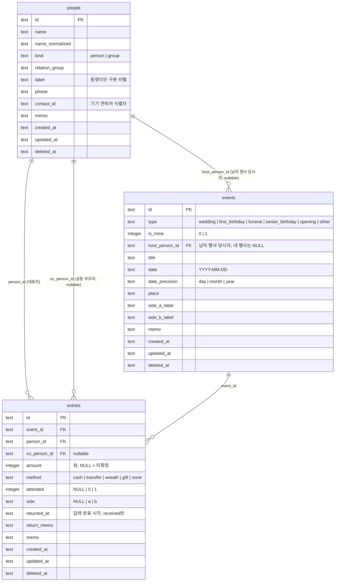

# 뿌린대로거두리라 — 1단계 데이터 모델

> 작성일 2026-09-14 · 작성 product-planner · 검토·보완 cto-orchestrator · 상태 CTO 검토 완료(사용자 확인 전)
> 기준 — SQLite(expo-sqlite) + Drizzle ORM. 금액은 integer(원). 날짜는 ISO 8601 텍스트. 모든 테이블은 UUID 텍스트 PK와 `created_at`/`updated_at`/`deleted_at`을 가진다(docs/04 CTO 결정 3). 기능 맥락은 docs/02.

## ✅ CTO 결정 사항 (2026-09-14 검토)

product-planner가 올린 확인 요청 4건은 모두 기본안을 승인했다. 검토 중 CTO가 추가로 바꾼 것이 2건 있다.

| # | 항목 | 결정 | 근거 |
|---|---|---|---|
| 1 | 공동 부조 컬럼 | `entries.co_person_id` 단일 nullable FK **승인** | 조인 테이블은 원장 조회마다 EXISTS가 붙고 가져오기·업로드 대상이 하나 는다. 3명 이상 봉투는 드물다 |
| 2 | 미확정 금액 | `entries.amount INTEGER NULL` **승인** | NULL은 SUM에서 자동 제외돼 집계 SQL이 단순하다. 0원(부조 없음)과 의미가 분리된다 |
| 3 | 소프트 삭제 행의 내보내기·업로드 | 포함(tombstone) **승인** | 두 기기의 백업을 병합할 때 tombstone 없이는 삭제가 되살아난다 |
| 4 | 이름 정규화 컬럼 | `people.name_normalized` 저장 시 계산 **승인** | SQLite `LOWER`는 ASCII만 처리한다. 컬럼이어야 인덱스를 탄다 |
| 5 | **`entries.direction` 제거** (CTO 추가) | 방향은 `events.is_mine`에서 파생한다. 컬럼으로 두지 않는다 | 초안은 조인을 피하려고 `direction`을 비정규화했으나, 이는 `is_mine`에서 100% 파생되는 값이다. 행사의 `is_mine`을 바꾸거나 기록을 다른 행사로 옮길 때 조용히 어긋나는 정체성 축 불일치가 생긴다. 로컬 SQLite에서 events 조인 비용은 무시할 수준이다 |
| 6 | **`events.host_person_id` 추가** (CTO 추가) | 남의 행사의 당사자를 nullable FK로 둔다. 내 행사는 NULL | 초안은 남의 행사와 당사자를 제목 문자열로만 연결했다. 그러면 미리 등록한 예정 행사(기록 0건)가 빠른 기록의 "기존 행사에 추가?" 판정(§5.7)에 잡히지 않아 중복 행사가 생기고, 사람 원장에서 "이 사람의 행사"를 구조적으로 찾을 수 없다 |

**금액 단위 규칙(구현 필수 조건)** — 앱 내부·DB·JSON의 금액 표현은 언제나 **원 단위 정수** 하나뿐이다. 금액 프리셋 "10만"과 키패드의 "만원 단위 토글"은 입력 컴포넌트 안에서만 ×10,000 변환을 수행하고, 도메인 함수·리포지토리·쿼리는 원 단위 값만 주고받는다. 서로 다른 단위의 값을 더하거나 곱하는 경로가 생기지 않도록 한다.

## 1. 엔티티와 ERD

| 엔티티 | 역할 | 비고 |
|---|---|---|
| `people` | 나와 경조사를 주고받는 상대. 개인 또는 단체 | 원장의 축. 이름 UNIQUE 없음 |
| `events` | 경조사 행사 1건. 남의 행사(`is_mine = 0`, 당사자 `host_person_id`)와 내 행사(`is_mine = 1`) 모두 | `is_mine`은 "나 또는 우리 가족이 주최한 행사"라는 뜻이다(부모님 칠순도 내 행사). 2단계 청첩장은 `is_mine = 1`에만 붙는다 |
| `entries` | 기록 1건. 어떤 행사에서 어떤 사람과 얼마를 주고받았는가 | 방향(준돈/받은돈)은 컬럼이 아니라 `events.is_mine`에서 파생한다. `is_mine = 0`이면 준돈, `1`이면 받은돈 |

세 테이블로 끝난다. 설정값(마지막 내보내기 시각, 앱 잠금 여부 등)은 테이블이 아니라 AsyncStorage 키로 둔다. 관계 그룹·행사 종류·부조 형태는 코드 상수(TEXT CHECK)이며 테이블로 만들지 않는다.



## 2. 테이블별 컬럼 명세

공통 컬럼(세 테이블 모두)은 다음과 같다.

| 컬럼 | 타입 | 제약 | 설명 |
|---|---|---|---|
| `id` | TEXT | PK | UUID v4. 앱에서 `expo-crypto`의 `randomUUID()`로 생성 |
| `created_at` | TEXT | NOT NULL | ISO 8601 UTC, 밀리초 포함(`2026-09-14T03:21:07.123Z`) |
| `updated_at` | TEXT | NOT NULL | 모든 UPDATE에서 앱이 갱신. 가져오기 병합의 승자 판정 기준 |
| `deleted_at` | TEXT | NULL | 소프트 삭제 시각. NULL이면 살아 있음. 모든 조회는 `deleted_at IS NULL`을 기본 조건으로 건다 |

### 2.1 `people`

| 컬럼 | 타입 | 제약 | 설명 |
|---|---|---|---|
| `name` | TEXT | NOT NULL, 길이 1~50 | 표시 이름. 앞뒤 공백 제거 후 저장 |
| `name_normalized` | TEXT | NOT NULL | 검색·자동완성용. 앱이 저장 시 계산 — NFC 정규화, 모든 공백 제거, 소문자. 인덱스 대상 |
| `kind` | TEXT | NOT NULL, CHECK IN ('person','group'), DEFAULT 'person' | 개인/단체. 단체는 전화·연락처 필드를 UI에서 숨긴다 |
| `relation_group` | TEXT | NOT NULL, CHECK IN ('family','relative','work','friend','acquaintance','other'), DEFAULT 'other' | 관계 그룹 6개 고정 |
| `label` | TEXT | NULL, 길이 ≤ 30 | 동명이인 구분 라벨. 예 "회사 동기", "고등학교" |
| `phone` | TEXT | NULL | 숫자·하이픈만. 검증은 느슨하게(형식 강제 없음) |
| `contact_id` | TEXT | NULL | expo-contacts가 주는 기기 연락처 id. 기기 종속이므로 2단계 업로드 시 버린다 |
| `memo` | TEXT | NULL, 길이 ≤ 500 | 자유 메모 |

### 2.2 `events`

| 컬럼 | 타입 | 제약 | 설명 |
|---|---|---|---|
| `type` | TEXT | NOT NULL, CHECK IN ('wedding','first_birthday','funeral','senior_birthday','opening','other') | 결혼식·돌잔치·장례식·회갑/칠순·개업·기타 |
| `is_mine` | INTEGER | NOT NULL, CHECK IN (0,1), DEFAULT 0 | 1이면 내 행사(받은돈), 0이면 남의 행사(준돈). **기록이 1건이라도 있으면 변경 불가**(앱 검증). 이 값이 소속 기록 전체의 방향을 결정하기 때문이다 |
| `host_person_id` | TEXT | NULL, FK → people.id | 남의 행사의 당사자(내가 돈을 주는 상대). 남의 행사는 NOT NULL, 내 행사는 NULL이어야 한다(앱 검증). 빠른 기록이 행사를 자동 생성할 때 기록의 `person_id`를 그대로 넣는다 |
| `title` | TEXT | NOT NULL, 길이 1~80 | 표시 제목. 자동 생성 규칙은 남의 행사 "{host_person 이름} {종류 한글} {연도}", 내 행사 "내 {종류 한글}". 사용자가 수정 가능 |
| `date` | TEXT | NOT NULL, `YYYY-MM-DD` | 행사 날짜. 정밀도가 month면 일을 01로, year면 월·일을 01-01로 채운다 |
| `date_precision` | TEXT | NOT NULL, CHECK IN ('day','month','year'), DEFAULT 'day' | 표시·필터 시 참조. day면 "2024.05.18", month면 "2024.05", year면 "2024년" |
| `place` | TEXT | NULL, 길이 ≤ 100 | 장소 |
| `side_a_label` | TEXT | NULL, 길이 ≤ 20 | 내 행사의 측 A 라벨(예 "신랑측"). 남의 행사는 항상 NULL |
| `side_b_label` | TEXT | NULL, 길이 ≤ 20 | 측 B 라벨(예 "신부측"). A가 NULL이면 B도 NULL이어야 한다(앱 검증) |
| `memo` | TEXT | NULL, 길이 ≤ 500 | 자유 메모 |

### 2.3 `entries`

| 컬럼 | 타입 | 제약 | 설명 |
|---|---|---|---|
| `event_id` | TEXT | NOT NULL, FK → events.id | 소속 행사. 기록은 반드시 행사에 속한다 |
| `person_id` | TEXT | NOT NULL, FK → people.id | 대표자(돈의 주인) |
| `co_person_id` | TEXT | NULL, FK → people.id, CHECK (co_person_id IS NULL OR co_person_id <> person_id) | 공동 부조자. 부부 한 봉투용 |
| `amount` | INTEGER | NULL, CHECK (amount IS NULL OR amount >= 0) | 원 단위 정수. NULL = 미확정. 0 = 부조 없음 |
| `method` | TEXT | NOT NULL, CHECK IN ('cash','transfer','wreath','gift','none'), DEFAULT 'cash' | 현금·이체·화환/조화·선물·없음 |
| `attended` | INTEGER | NULL, CHECK IN (0,1) | 참석 여부. NULL = 미기록 |
| `side` | TEXT | NULL, CHECK IN ('a','b') | 내 행사의 측. 행사에 측 라벨이 없으면 NULL |
| `returned_at` | TEXT | NULL | 답례 완료 시각. received 기록에서만 의미 있음. NULL = 미완료 |
| `return_memo` | TEXT | NULL, 길이 ≤ 200 | 답례 메모 |
| `memo` | TEXT | NULL, 길이 ≤ 500 | 자유 메모. 대리 부조("김철수 편에 전달")는 여기 |

기록 자체에는 날짜도 방향도 없다. 날짜는 `events.date`, 방향은 `events.is_mine`을 쓴다. 💡 기획 판단 — 이체가 행사 며칠 뒤 들어오는 경우가 있지만 원장에서 의미 있는 날짜는 행사일이다. 입금일이 필요하면 메모로 둔다. CTO 결정 5 — 방향을 컬럼으로 두면 `is_mine`과 어긋날 수 있으므로 파생값으로만 다룬다. 원장·통계 쿼리는 항상 `events`를 조인한다.

## 3. 정체성 축 — UNIQUE 제약과 인덱스

| 테이블 | 제약/인덱스 | 목적 |
|---|---|---|
| `people` | PK `id` | 사람의 정체성은 UUID뿐이다 |
| `people` | **UNIQUE 없음 on `name`** (의도적) | 동명이인 허용. 구별은 `label`·`relation_group`·기록 이력으로 사용자가 한다. 앱은 저장 시 `name_normalized`가 같은 살아 있는 행이 있으면 경고만 한다 |
| `people` | UNIQUE partial `contact_id WHERE contact_id IS NOT NULL AND deleted_at IS NULL` | 한 연락처가 두 사람에 붙지 않게 |
| `people` | INDEX `(name_normalized) WHERE deleted_at IS NULL` | 자동완성 prefix 검색 |
| `events` | PK `id` | 행사의 정체성은 UUID. 같은 사람·같은 종류가 여러 번 있을 수 있으므로 (person, type, date)에 UNIQUE를 걸지 않는다 |
| `events` | INDEX `(date DESC) WHERE deleted_at IS NULL` | 행사 목록·다가오는 행사·기간 통계 |
| `events` | INDEX `(is_mine, date DESC) WHERE deleted_at IS NULL` | 내 행사/남의 행사 세그먼트 |
| `events` | INDEX `(host_person_id) WHERE host_person_id IS NOT NULL AND deleted_at IS NULL` | 빠른 기록의 "기존 행사에 추가?" 판정(§5.7), 사람 원장의 행사 목록 |
| `entries` | PK `id` | 기록 1건 = 봉투 1개. 같은 사람이 같은 행사에 두 번 기록될 수 있다(현금 + 화환) → (event_id, person_id) UNIQUE 없음 |
| `entries` | INDEX `(person_id) WHERE deleted_at IS NULL` | 원장 |
| `entries` | INDEX `(co_person_id) WHERE co_person_id IS NOT NULL AND deleted_at IS NULL` | 공동 부조자 원장 |
| `entries` | INDEX `(event_id) WHERE deleted_at IS NULL` | 행사 상세·합계 |
| `entries` | INDEX `(created_at DESC) WHERE deleted_at IS NULL` | 최근 기록·연속 입력 목록 |

동명이인은 데이터 차원에서 "다른 `id`를 가진 두 행"일 뿐이며, 이름이 같다는 사실은 제약이 아니라 UI 경고의 근거다. 병합은 한 트랜잭션에서 `UPDATE entries SET person_id = :survivor WHERE person_id = :victim`, `co_person_id` 동일 처리, `UPDATE events SET host_person_id = :survivor WHERE host_person_id = :victim`, 그리고 `victim`의 소프트 삭제로 끝난다. 병합 결과 `person_id = co_person_id`가 되는 행(부부를 하나로 잘못 병합한 경우)은 앱이 사전에 검사해 병합을 거부한다.

사람을 참조하는 축은 세 곳(`entries.person_id`, `entries.co_person_id`, `events.host_person_id`)이다. 병합·삭제 로직은 반드시 세 곳을 모두 다뤄야 한다. 도메인 함수 하나(`reassignPerson(victim, survivor)`)로 묶어 두 경로가 같은 코드를 타게 한다.

SQLite 외래키는 `PRAGMA foreign_keys = ON`으로 켜되 `ON DELETE`는 지정하지 않는다. 물리 삭제를 하지 않기 때문이다. 참조 무결성은 소프트 삭제 시 앱이 유지한다(docs/02 §5 사람·이벤트 삭제 방침).

## 4. 공동·단체·대리 부조의 표현과 수지 계산 규칙

| 관례 | 스키마 | 수지 계산 규칙 |
|---|---|---|
| 공동 부조("김철수·이영희 10만원") | `entries` 1행. `person_id = 김철수`, `co_person_id = 이영희`, `amount = 100000` | 김철수 원장 합계 +10만, 이영희 원장 합계 +10만(둘 다 "공동" 배지). 행사 합계·기간 합계·전체 합계는 `entries` 행 기준이므로 10만 한 번. 사람별 상위 통계에는 두 사람 모두에 잡히며 화면 각주로 알린다 |
| 단체 부조("영업1팀 일동 30만원") | `people` 1행 `kind = 'group'`, `entries` 1행 그 사람에게 | 개인과 동일 규칙. 단체의 원장·수지도 계산된다 |
| 대리 부조(A가 B 돈을 전달) | `entries.person_id = B`, `memo = "A 편에 전달"` | A에게는 아무것도 잡히지 않는다 |
| 미확정 금액 | `amount = NULL` | 모든 SUM에서 제외. `COUNT(*) FILTER (WHERE amount IS NULL)`로 "미확정 N건" |
| 부조 없음(참석만) | `amount = 0, method = 'none', attended = 1` | 합계에 0으로 포함, 건수에는 포함 |

사람 P의 수지는 다음 정의로 고정한다.

- 준 합계 `given_total` = `SUM(amount)` over entries JOIN events where `events.is_mine = 0` and (`person_id = P` or `co_person_id = P`) and 두 테이블 모두 `deleted_at IS NULL`.
- 받은 합계 `received_total` = 같은 조건에 `events.is_mine = 1`.
- 차액 `balance` = `given_total - received_total`. 양수면 "내가 더 줌", 음수면 "내가 더 받음".
- 미확정 건수는 방향별로 따로 센다.

## 5. 핵심 조회 쿼리(의사 SQL)

### 5.1 사람별 수지(원장 상단 카드)

```sql
SELECT
  SUM(CASE WHEN e.is_mine = 0 THEN en.amount END) AS given_total,
  SUM(CASE WHEN e.is_mine = 1 THEN en.amount END) AS received_total,
  COUNT(CASE WHEN e.is_mine = 0 AND en.amount IS NULL THEN 1 END) AS given_unconfirmed,
  COUNT(CASE WHEN e.is_mine = 1 AND en.amount IS NULL THEN 1 END) AS received_unconfirmed,
  COUNT(*) AS entry_count
FROM entries en
JOIN events e ON e.id = en.event_id AND e.deleted_at IS NULL
WHERE (en.person_id = :person_id OR en.co_person_id = :person_id)
  AND en.deleted_at IS NULL;
```

원장 목록은 같은 FROM·WHERE에 `e.date DESC, en.created_at DESC` 정렬을 붙이고, `co_person_id = :person_id`인 행은 "공동" 배지를 붙인다. 방향 표시는 `e.is_mine`으로 판단한다.

### 5.2 사람 목록(차액 포함)

```sql
SELECT p.id, p.name, p.label, p.relation_group, p.kind,
  COALESCE(SUM(CASE WHEN e.is_mine = 0 THEN en.amount END), 0)
  - COALESCE(SUM(CASE WHEN e.is_mine = 1 THEN en.amount END), 0) AS balance,
  MAX(en.created_at) AS last_entry_at
FROM people p
LEFT JOIN entries en
  ON (en.person_id = p.id OR en.co_person_id = p.id) AND en.deleted_at IS NULL
LEFT JOIN events e
  ON e.id = en.event_id AND e.deleted_at IS NULL
WHERE p.deleted_at IS NULL
  AND (:group IS NULL OR p.relation_group = :group)
GROUP BY p.id
ORDER BY p.name_normalized;  -- 정렬 옵션에 따라 last_entry_at DESC 또는 balance DESC
```

### 5.3 이벤트별 합계(행사 상세 상단, 측별·형태별)

```sql
SELECT
  side,
  method,
  COUNT(*)                                        AS cnt,
  SUM(amount)                                     AS total,
  COUNT(CASE WHEN amount IS NULL THEN 1 END)      AS unconfirmed,
  COUNT(CASE WHEN returned_at IS NOT NULL THEN 1 END) AS returned
FROM entries
WHERE event_id = :event_id AND deleted_at IS NULL
GROUP BY side, method;
```

앱은 이 결과를 메모리에서 세 단계로 접는다. 전체 합계, 측별(`side`) 합계, 형태별(`method`) 건수·합계. 쿼리를 세 번 날리지 않는다.

### 5.4 기간별·종류별·그룹별 통계

```sql
SELECT
  substr(e.date, 1, 4)  AS year,
  e.is_mine,            -- 0 = 준돈, 1 = 받은돈
  e.type,
  p.relation_group,
  COUNT(*)              AS cnt,
  SUM(en.amount)        AS total
FROM entries en
JOIN events e ON e.id = en.event_id AND e.deleted_at IS NULL
JOIN people p ON p.id = en.person_id AND p.deleted_at IS NULL
WHERE en.deleted_at IS NULL
  AND (:year IS NULL OR substr(e.date, 1, 4) = :year)
GROUP BY year, e.is_mine, e.type, p.relation_group;
```

관계 그룹은 대표자(`person_id`)의 그룹으로 집계한다. 공동 부조자의 그룹이 다르더라도 대표자 기준 한 번만 센다. 연도는 `date_precision`과 무관하게 `date`의 앞 4자리로 묶으므로 "연도만 아는 기록"도 포함된다.

### 5.5 이름 자동완성

```sql
SELECT p.id, p.name, p.label, p.relation_group, p.kind,
  (SELECT e.date || '|' || e.type || '|' || e.is_mine || '|' || COALESCE(en.amount, -1)
     FROM entries en JOIN events e ON e.id = en.event_id
    WHERE (en.person_id = p.id OR en.co_person_id = p.id)
      AND en.deleted_at IS NULL AND e.deleted_at IS NULL
    ORDER BY e.date DESC, en.created_at DESC LIMIT 1) AS last_entry
FROM people p
WHERE p.deleted_at IS NULL
  AND p.name_normalized LIKE :prefix || '%'   -- :prefix는 앱에서 정규화한 입력
ORDER BY (SELECT MAX(created_at) FROM entries WHERE person_id = p.id) DESC NULLS LAST,
         p.name_normalized
LIMIT 8;
```

입력이 비어 있을 때의 "최근 사람 5명 칩"은 `entries`를 `created_at DESC`로 훑어 `person_id`를 DISTINCT로 5개 뽑는다. `LIKE`는 SQLite에서 ASCII만 대소문자 무시이므로 `name_normalized`와 `:prefix` 양쪽을 앱에서 소문자로 맞춘다. 초성 검색("ㄱㅊ")은 1단계 범위 밖이다.

### 5.6 최근 기록(홈)

```sql
SELECT en.id, en.amount, en.method, en.side,
       p.name AS person_name, cp.name AS co_person_name,
       e.title AS event_title, e.type, e.is_mine, e.date, e.date_precision
FROM entries en
JOIN events e  ON e.id = en.event_id AND e.deleted_at IS NULL
JOIN people p  ON p.id = en.person_id
LEFT JOIN people cp ON cp.id = en.co_person_id
WHERE en.deleted_at IS NULL
ORDER BY en.created_at DESC
LIMIT 10;
```

### 5.7 빠른 기록 저장 시 "기존 행사에 추가?" 판정

```sql
SELECT e.id, e.title, e.date
FROM events e
WHERE e.deleted_at IS NULL AND e.is_mine = 0
  AND e.host_person_id = :person_id
  AND e.type = :type
  AND e.date BETWEEN date(:date, '-7 days') AND date(:date, '+7 days')
ORDER BY abs(julianday(e.date) - julianday(:date))
LIMIT 1;
```

`host_person_id`로 판정하므로 미리 등록해 둔 예정 행사(기록 0건)도 잡힌다. CTO 결정 6의 이유다.

## 6. Drizzle 스키마 초안

```typescript
// src/db/schema.ts — 1단계 SQLite 스키마(people · events · entries)
import { sqliteTable, text, integer, index, uniqueIndex, check } from 'drizzle-orm/sqlite-core';
import { sql } from 'drizzle-orm';

const timestamps = {
  createdAt: text('created_at').notNull(),
  updatedAt: text('updated_at').notNull(),
  deletedAt: text('deleted_at'),
};

export const people = sqliteTable(
  'people',
  {
    id: text('id').primaryKey(),
    name: text('name').notNull(),
    nameNormalized: text('name_normalized').notNull(),
    kind: text('kind', { enum: ['person', 'group'] }).notNull().default('person'),
    relationGroup: text('relation_group', {
      enum: ['family', 'relative', 'work', 'friend', 'acquaintance', 'other'],
    }).notNull().default('other'),
    label: text('label'),
    phone: text('phone'),
    contactId: text('contact_id'),
    memo: text('memo'),
    ...timestamps,
  },
  (t) => [
    index('people_name_normalized_idx').on(t.nameNormalized).where(sql`${t.deletedAt} IS NULL`),
    uniqueIndex('people_contact_id_uq').on(t.contactId)
      .where(sql`${t.contactId} IS NOT NULL AND ${t.deletedAt} IS NULL`),
  ],
);

export const events = sqliteTable(
  'events',
  {
    id: text('id').primaryKey(),
    type: text('type', {
      enum: ['wedding', 'first_birthday', 'funeral', 'senior_birthday', 'opening', 'other'],
    }).notNull(),
    isMine: integer('is_mine', { mode: 'boolean' }).notNull().default(false),
    hostPersonId: text('host_person_id').references(() => people.id), // 남의 행사 당사자, 내 행사는 NULL
    title: text('title').notNull(),
    date: text('date').notNull(), // YYYY-MM-DD
    datePrecision: text('date_precision', { enum: ['day', 'month', 'year'] }).notNull().default('day'),
    place: text('place'),
    sideALabel: text('side_a_label'),
    sideBLabel: text('side_b_label'),
    memo: text('memo'),
    ...timestamps,
  },
  (t) => [
    index('events_date_idx').on(t.date).where(sql`${t.deletedAt} IS NULL`),
    index('events_is_mine_date_idx').on(t.isMine, t.date).where(sql`${t.deletedAt} IS NULL`),
    index('events_host_person_idx').on(t.hostPersonId)
      .where(sql`${t.hostPersonId} IS NOT NULL AND ${t.deletedAt} IS NULL`),
  ],
);

export const entries = sqliteTable(
  'entries',
  {
    id: text('id').primaryKey(),
    eventId: text('event_id').notNull().references(() => events.id),
    personId: text('person_id').notNull().references(() => people.id),
    coPersonId: text('co_person_id').references(() => people.id),
    amount: integer('amount'), // 원. NULL = 미확정. 방향은 events.isMine에서 파생
    method: text('method', { enum: ['cash', 'transfer', 'wreath', 'gift', 'none'] })
      .notNull().default('cash'),
    attended: integer('attended', { mode: 'boolean' }),
    side: text('side', { enum: ['a', 'b'] }),
    returnedAt: text('returned_at'),
    returnMemo: text('return_memo'),
    memo: text('memo'),
    ...timestamps,
  },
  (t) => [
    index('entries_person_idx').on(t.personId).where(sql`${t.deletedAt} IS NULL`),
    index('entries_co_person_idx').on(t.coPersonId)
      .where(sql`${t.coPersonId} IS NOT NULL AND ${t.deletedAt} IS NULL`),
    index('entries_event_idx').on(t.eventId).where(sql`${t.deletedAt} IS NULL`),
    index('entries_created_idx').on(t.createdAt).where(sql`${t.deletedAt} IS NULL`),
    check('entries_amount_nonneg', sql`${t.amount} IS NULL OR ${t.amount} >= 0`),
    check('entries_co_person_diff', sql`${t.coPersonId} IS NULL OR ${t.coPersonId} <> ${t.personId}`),
  ],
);

export type Person = typeof people.$inferSelect;
export type Event = typeof events.$inferSelect;
export type Entry = typeof entries.$inferSelect;
```

`drizzle-kit generate`로 마이그레이션 SQL을 만들고 앱 시작 시 `migrate()`를 돌린다. Drizzle의 `text({ enum })`은 타입 수준 제약이며 SQLite CHECK를 자동 생성하지 않으므로, 열거값 CHECK가 DB 차원에서 필요하면 마이그레이션 SQL에 직접 추가한다. 💡 기획 판단 — 1단계는 앱이 유일한 쓰기 주체이므로 타입 제약으로 충분하고, `amount`·`co_person_id` 두 CHECK만 DB에 둔다.

## 7. 2단계 확장 영향 검토

### 7.1 추가되는 테이블(2단계, Postgres/Supabase)

| 테이블 | 핵심 컬럼 | 1단계 테이블과의 관계 |
|---|---|---|
| `invitations` | `id`, `user_id`, `event_id` → events(is_mine = 1), `slug` UNIQUE(공개 URL), `template`, `content` JSONB(문구·사진·지도), `published_at`, `expires_at` | 이벤트 1 : 청첩장 0..1. 남의 행사에는 붙지 않도록 앱·RLS가 `is_mine`을 검사 |
| `rsvps` | `id`, `invitation_id`, `guest_name`, `guest_phone`, `side` ('a'/'b'), `attending`, `headcount`, `message`, `linked_person_id` → people(nullable), `created_at` | 하객 회신. 주인이 회신을 사람으로 승격하면 `linked_person_id`가 채워지고 이후 `entries.person_id`로 이어진다. `side` 값 체계가 1단계 `entries.side`와 같아 그대로 넘어온다 |
| `bank_accounts` | `id`, `user_id`, `event_id`, `side`, `bank_name`, `account_number`, `holder_name`, `sort_order` | 청첩장의 축의금 계좌 안내. 측별로 여러 계좌 |

### 7.2 1단계 테이블에 추가되는 컬럼

| 테이블 | 추가 컬럼 | 설명 |
|---|---|---|
| `people`, `events`, `entries` | `user_id UUID NOT NULL` → auth.users | 소유자. RLS 기준. 업로드 시 서버가 채운다 |
| `people` | `source` ('manual' / 'contact' / 'rsvp'), `rsvp_id` nullable | RSVP에서 승격된 사람의 출처 추적. 선택 |
| `events` | `invitation_id`는 두지 않는다 | 방향은 invitations → events. 이벤트 쪽에 컬럼을 두면 순환 참조가 생긴다 |
| `entries` | `rsvp_id` nullable | RSVP를 통해 미리 등록된 기록인지 표시. 선택 |

### 7.3 1단계 스키마 중 바꿔야 할 것

없다. 이유는 다음과 같다.

- 청첩장은 `events.is_mine = 1`에만 붙는데 이 컬럼이 1단계부터 있다.
- 양가 구분(`side`)이 1단계에 이미 2값 체계로 있어 RSVP·계좌 안내가 같은 값을 쓴다.
- 모든 PK가 UUID라 서버 테이블의 PK로 그대로 쓸 수 있고, `created_at`/`updated_at`/`deleted_at`이 있어 업로드 시 이력이 보존된다.
- 관계 그룹·행사 종류·부조 형태가 코드 상수라 서버에도 같은 상수를 두면 된다. 테이블로 만들었다면 참조 테이블까지 업로드해야 했다.
- `contact_id`만 기기 종속이므로 업로드 시 제외한다(서버 컬럼을 만들지 않는다).

바뀌는 것은 SQLite `sqliteTable` 선언을 `pgTable`로 다시 쓰는 일뿐이다(docs/04 §2). 타입은 `text` → `text`/`uuid`, `integer boolean` → `boolean`, 날짜 `text` → `date`/`timestamptz`로 매핑한다.

### 7.4 1회 업로드 마이그레이션(로컬 → Supabase) 방침

1. **UUID 충돌** — v4 UUID는 122비트 난수라 충돌은 실질적으로 발생하지 않는다. 재발급·재전송 로직은 만들지 않는다. 업로드는 `INSERT`로 보내고 삽입 건수가 요청 건수와 다르면 실패로 처리해 로그를 남기고 사용자에게 재시도를 안내한다(CTO 판단 — 발생하지 않는 사건을 위한 치환 로직은 과설계다).
2. **소프트 삭제 행** — `deleted_at IS NOT NULL`인 행도 그대로 업로드한다(❓ 3번). 서버는 이를 tombstone으로 보관하며, 이후 앱은 서버를 SoT로 쓴다. 업로드가 끝나면 로컬 DB는 캐시로 강등되므로 tombstone이 로컬에서 늘어날 걱정은 없다.
3. **순서** — people → events → entries 순으로 FK 방향을 따른다. 배치 500행씩. 중간 실패 시 마지막 성공 배치부터 재개할 수 있게 로컬에 `upload_cursor`(AsyncStorage)를 둔다.
4. **검증** — 업로드 후 서버의 테이블별 `COUNT(*)`와 사람별 수지 상위 10명을 로컬과 대조하고 일치할 때만 "서버 모드"로 전환한다.
5. **되돌리기** — 전환 전에 자동으로 JSON 내보내기(§8)를 한 번 수행해 파일로 남긴다.

## 8. JSON 내보내기 포맷 초안

```json
{
  "format": "ppurin-backup",
  "version": 1,
  "exported_at": "2026-09-14T03:21:07.123Z",
  "app_version": "1.0.0",
  "schema_version": 1,
  "counts": { "people": 120, "events": 45, "entries": 380 },
  "data": {
    "people": [
      {
        "id": "0f3a2c6e-8b1d-4a2e-9c7f-2e5d1b4a6c8e",
        "name": "김철수",
        "name_normalized": "김철수",
        "kind": "person",
        "relation_group": "work",
        "label": "회사 동기",
        "phone": null,
        "contact_id": null,
        "memo": null,
        "created_at": "2025-03-01T09:00:00.000Z",
        "updated_at": "2025-03-01T09:00:00.000Z",
        "deleted_at": null
      }
    ],
    "events": [
      {
        "id": "7d9b1e4f-2c3a-4f5b-8e6d-1a2b3c4d5e6f",
        "type": "wedding",
        "is_mine": false,
        "host_person_id": "0f3a2c6e-8b1d-4a2e-9c7f-2e5d1b4a6c8e",
        "title": "김철수 결혼식 2025",
        "date": "2025-05-18",
        "date_precision": "day",
        "place": null,
        "side_a_label": null,
        "side_b_label": null,
        "memo": null,
        "created_at": "2025-05-18T02:10:00.000Z",
        "updated_at": "2025-05-18T02:10:00.000Z",
        "deleted_at": null
      }
    ],
    "entries": [
      {
        "id": "b2c3d4e5-f6a7-4b8c-9d0e-1f2a3b4c5d6e",
        "event_id": "7d9b1e4f-2c3a-4f5b-8e6d-1a2b3c4d5e6f",
        "person_id": "0f3a2c6e-8b1d-4a2e-9c7f-2e5d1b4a6c8e",
        "co_person_id": null,
        "amount": 100000,
        "method": "cash",
        "attended": true,
        "side": null,
        "returned_at": null,
        "return_memo": null,
        "memo": null,
        "created_at": "2025-05-18T02:10:00.000Z",
        "updated_at": "2025-05-18T02:10:00.000Z",
        "deleted_at": null
      }
    ]
  }
}
```

규칙은 다음과 같다.

- 컬럼명은 DB 컬럼명(snake_case)을 그대로 쓴다. Drizzle의 camelCase 속성명은 앱 내부용이며 파일에 노출하지 않는다.
- `version`은 파일 포맷 버전, `schema_version`은 Drizzle 마이그레이션 번호다. 가져오기는 `version`이 앱이 아는 값보다 크면 거부하고, 작으면 버전별 변환 함수를 순서대로 적용한다.
- 소프트 삭제 행을 포함한다(❓ 3번). 가져오기 병합 규칙은 id 일치 시 `updated_at`이 큰 쪽 유지, 삭제 여부도 그 행의 `deleted_at`을 따른다.
- `contact_id`는 포함하되 다른 기기에서 가져올 때 앱이 NULL로 바꾼다(기기 종속 값).
- 금액은 JSON number(정수). 문자열로 감싸지 않는다. SQLite INTEGER 64비트 범위 안이고 JS number 안전 정수 범위(2^53) 안이다.
- 파일은 UTF-8, 압축 없음. 380건 기준 약 150KB로 예상되며 수만 건이어도 수 MB 수준이다.

## 📋 CTO 보고 요약

- 테이블은 `people`·`events`·`entries` 셋뿐이며 열거값은 코드 상수다. 모든 행이 UUID PK와 `created_at`/`updated_at`/`deleted_at`을 가진다.
- 관례 처리는 컬럼 수준으로 끝냈다. 공동 부조 `co_person_id`, 단체 `people.kind`, 미확정 `amount NULL`, 날짜 불명 `date_precision`, 양가 `side_a/b_label` + `entries.side`. 조인 테이블은 만들지 않았다.
- 정체성 축은 UUID뿐이고 이름에 UNIQUE가 없다. 사람을 참조하는 축은 `entries.person_id`·`entries.co_person_id`·`events.host_person_id` 세 곳이며 병합·삭제는 한 함수로 세 곳을 함께 다룬다. `contact_id`만 부분 UNIQUE.
- 기록의 방향(준돈/받은돈)은 컬럼이 아니라 `events.is_mine`에서 파생한다(CTO 검토로 `direction` 제거). 사람별 수지는 `person_id OR co_person_id`로 공동 기록을 양쪽에 전액 반영하고, 행사·기간 합계는 행 단위라 중복이 없다. 의사 SQL 7개를 실었다.
- 2단계는 `user_id` 추가와 `invitations`·`rsvps`·`bank_accounts` 신설로 끝나며 1단계 스키마 변경은 없다. 업로드는 people → events → entries 순, tombstone 포함이다.
