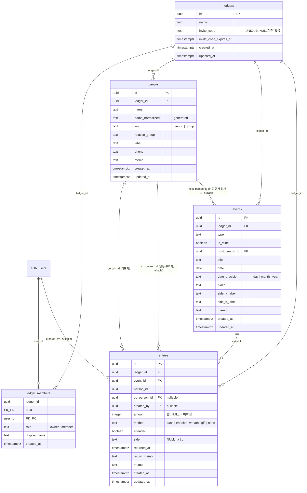

# 뿌린대로거두리라 — 1단계 데이터 모델

> 작성일 2026-09-14 · 작성 product-planner · 검토·보완 cto-orchestrator · 2026-09-15 클라우드 개정 · **2026-09-16 공동 장부 확정에 따라 소유 축을 장부(`ledger_id`)로 재설계**
> 기준 — Supabase Postgres + RLS(확정). 앱은 supabase-js로 테이블·뷰·RPC를 직접 호출하며 별도 API 서버는 없다. 금액은 integer(원). 기능 맥락은 docs/02.

## ✅ CTO 결정 사항

### 2026-09-16 개정 (공동 장부 — 소유 축 `user_id` → `ledger_id`)

| # | 항목 | 결정 | 근거 |
|---|---|---|---|
| 15 | 소유 축 | 데이터(people·events·entries)는 **장부(`ledgers`)** 에 속하고, 사용자는 **구성원(`ledger_members`)** 으로 장부에 속한다 | 부부가 한 장부를 함께 쓰려면 "행의 주인"이 사람이 아니라 장부여야 한다. 사용자 확인 질문 11번 "예"의 직접 결과 |
| 16 | 역할 | `owner` / `member` 두 개. 차이는 **owner만 초대 코드 발급과 구성원 제거가 가능**하다는 것뿐. 데이터 읽기·쓰기는 동일 | 부부 장부에서 데이터 권한 차이는 의미가 없다. 초대·제거만 한 사람이 통제하면 충분하다 |
| 17 | 초대 방식 | **초대 코드**(8자, 24시간, 1회용). owner가 발급해 카톡 등으로 전달, 상대가 앱에 입력 | 딥링크는 유니버설 링크 설정과 링크 도메인이, 전화번호 매칭은 전화번호 수집과 인증이, 이메일 초대는 발송 인프라가 필요하다. 코드 입력은 서버 함수 하나와 입력창 하나로 끝난다 |
| 18 | 장부 생성 | 첫 로그인 시 `auth.users` INSERT 트리거가 개인 장부("내 장부")와 owner 구성원을 자동 생성. 앱에 "장부 만들기" 기능은 두지 않는다 | 클라이언트 코드 없이 모든 사용자가 장부 1개를 보장받는다. 추가 장부가 필요하다는 근거가 없다 |
| 19 | 여러 장부 | 한 사용자가 여러 장부의 구성원일 수 있다(합류 전 개인 장부에 기록이 있던 경우). 앱은 "현재 장부" 1개를 선택해 보여 주고 더보기 → 장부에서 전환한다 | 합류 시 기존 기록을 강제로 합치거나 버리게 하는 것보다 단순하다. 장부 합치기는 이후 후보 |
| 20 | 빈 개인 장부 정리 | `join_ledger`가 합류 성공 시 호출자가 **유일한 구성원이고 데이터가 0건인** 장부를 삭제한다 | 배우자가 설치 → 자동 생성된 빈 장부 → 코드 입력 → 합류가 주 흐름이다. 빈 장부가 남으면 전환 목록에 쓸모없는 항목이 생긴다 |
| 21 | 계정 삭제 | `prepare_account_deletion()`이 구성원인 장부마다 "혼자면 장부와 데이터 삭제, 아니면 구성원만 제거(owner였으면 가장 먼저 합류한 구성원에게 승계)"를 수행한 뒤 Edge Function이 사용자를 삭제 | 코디네이터 지시 그대로. 배우자가 남아 있는 장부의 데이터는 그대로 남는다 |
| 22 | 입력자 기록 | `entries.created_by`(nullable, 기본값 `auth.uid()`)만 둔다. people·events에는 두지 않는다 | 공동 장부에서 "이 기록 누가 넣었지"는 실제로 묻게 되는 질문이다. 사람·행사는 공유 자산이라 입력자가 의미 없다 |
| 23 | 구성원 표시 이름 | `ledger_members.display_name`을 합류 시점에 `auth.users` 메타데이터에서 복사 | `auth.users`는 클라이언트가 읽을 수 없다. 구성원 목록 표시를 위해 `profiles` 테이블을 만드는 것보다 컬럼 하나가 싸다 |
| 24 | 구성원 변경은 RPC만 | `ledger_members`에 클라이언트 INSERT/UPDATE/DELETE 정책을 두지 않는다. 합류·탈퇴·제거는 SECURITY DEFINER 함수가 검사 후 수행 | "마지막 구성원은 나갈 수 없다", "owner 승계" 같은 규칙을 정책식으로 쓰면 읽기 어렵다. 함수 안의 IF문이 명확하다 |

### 2026-09-19 개정 (구현·검증 중 발견해 고친 것)

| # | 항목 | 결정 | 근거 |
|---|---|---|---|
| 25 | **남의 행사의 당사자 필수는 CHECK가 아니라 INSERT 트리거** | CHECK는 `not is_mine or host_person_id is null`(내 행사는 당사자 없음)만 남기고, "남의 행사는 당사자 필수"는 `events_validate` 트리거가 INSERT일 때만 본다 | 처음에는 양방향을 CHECK 하나로 묶었는데, 사람을 지울 때 FK의 `ON DELETE SET NULL`이 남의 행사의 당사자를 NULL로 만들면서 그 CHECK에 걸려 **삭제 자체가 실패했다**(검증 T11.5에서 실제로 터졌다). docs/02 §5의 "다른 기록이 남아 있으면 당사자만 비운다"가 CHECK와 모순이었다. 결과적으로 "만들 때는 필수, 당사자가 삭제된 뒤에는 비어 있을 수 있음"이 된다 |
| 26 | 앱은 사람·행사·기록을 **순차로** INSERT한다 | 하나의 데이터 수정 CTE(`with ... insert ... insert`)로 묶지 않는다 | CTE의 각 문장은 같은 스냅샷을 보므로 뒤 문장이 앞 CTE가 넣은 행을 보지 못한다. FK와 같은 장부 검사 트리거가 전부 실패한다(검증 T10.1에서 확인). 빠른 기록(docs/02 §3.2)이 사람·행사·기록을 한 번에 만드는 흐름이라 구현 시 주의가 필요하다 |

### 2026-09-15 결정 (유지)

| # | 항목 | 결정 |
|---|---|---|
| 8 | 접근 제어 | 테이블마다 RLS 정책 4개(SELECT/INSERT/UPDATE/DELETE). 조건은 이제 `is_ledger_member(ledger_id)`. UPDATE는 USING과 WITH CHECK 둘 다 |
| 9 | 물리 삭제 | 소프트 삭제 없음. FK `ON DELETE` 규칙 |
| 10 | 이름 정규화 | `people.name_normalized` generated column |
| 11 | 집계 | 뷰 `person_balances` + RPC `event_summary`·`stats_by_year` (security invoker) |
| 12 | 삭제·병합 | RPC `delete_person`·`merge_people` (security invoker) |
| 13 | 오프라인 | 읽기 캐시, 쓰기 온라인 필수, 큐 없음 (§7) |
| 14 | 가져오기 없음 | JSON 내보내기만 |

### 2026-09-14 결정 (유지)

| # | 항목 | 결정 |
|---|---|---|
| 1 | 공동 부조 | `entries.co_person_id` 단일 nullable FK. **장부 공유와는 다른 개념**이다(§4) |
| 2 | 미확정 금액 | `entries.amount integer NULL` |
| 5 | `entries.direction` 없음 | 방향은 `events.is_mine`에서 파생 |
| 6 | `events.host_person_id` | 남의 행사의 당사자 FK |

**금액 단위 규칙(구현 필수 조건)** — 앱 내부·DB·JSON의 금액 표현은 언제나 **원 단위 정수** 하나뿐이다. "10만" 프리셋과 만원 단위 토글의 ×10,000 변환은 입력 컴포넌트 안에서만 수행한다.

**장부 필터 규칙(구현 필수 조건)** — RLS는 "내가 구성원인 모든 장부"를 허용하므로, 앱의 모든 조회는 반드시 `ledger_id = 현재 장부`를 조건으로 붙여야 한다. 리포지토리 함수는 `ledgerId`를 필수 인자로 받고, 인자 없는 조회 함수를 만들지 않는다. 이 필터가 빠지면 두 장부의 데이터가 섞여 보인다.

## 1. 엔티티와 ERD

| 엔티티 | 역할 | 비고 |
|---|---|---|
| `auth.users` | Supabase Auth 사용자. 앱 테이블이 아니다 | 클라이언트가 읽을 수 없다 |
| `ledgers` | 장부 1권. 데이터의 소유 단위 | 첫 로그인 시 자동 생성. 초대 코드를 가진다 |
| `ledger_members` | 장부와 사용자의 소속 관계 + 역할 | PK (ledger_id, user_id). 표시 이름 보관 |
| `people` | 장부 안에서 경조사를 주고받는 상대 | 원장의 축. 이름 UNIQUE 없음 |
| `events` | 경조사 행사 1건 | `is_mine`은 "우리 장부(우리 집)가 주최한 행사" |
| `entries` | 기록 1건 | 방향은 `events.is_mine`에서 파생. `created_by`로 입력자 보관 |



## 2. 테이블별 컬럼 명세

### 2.1 `ledgers`

| 컬럼 | 타입 | 제약 | 설명 |
|---|---|---|---|
| `id` | uuid | PK, DEFAULT `gen_random_uuid()` | |
| `name` | text | NOT NULL, CHECK 길이 1~30, DEFAULT '내 장부' | 구성원 누구나 수정 가능(컬럼 단위 UPDATE 권한) |
| `invite_code` | text | NULL, UNIQUE | 8자, 혼동 문자(0/O/1/I) 제외 대문자·숫자. NULL이면 진행 중인 초대 없음 |
| `invite_code_expires_at` | timestamptz | NULL | 발급 후 24시간 |
| `created_at`, `updated_at` | timestamptz | NOT NULL | |

### 2.2 `ledger_members`

| 컬럼 | 타입 | 제약 | 설명 |
|---|---|---|---|
| `ledger_id` | uuid | PK 일부, FK → ledgers ON DELETE CASCADE | |
| `user_id` | uuid | PK 일부, FK → auth.users ON DELETE CASCADE | |
| `role` | text | NOT NULL, CHECK IN ('owner','member') | 장부당 owner는 정확히 1명(함수가 유지) |
| `display_name` | text | NOT NULL | 합류 시점에 `auth.users.raw_user_meta_data`의 name/full_name/nickname, 없으면 이메일 앞부분, 그것도 없으면 '구성원'. 이후 갱신하지 않는다 |
| `created_at` | timestamptz | NOT NULL | 합류 시각. owner 승계 순서의 기준 |

### 2.3 `people` · `events` · `entries` 공통

| 컬럼 | 타입 | 제약 | 설명 |
|---|---|---|---|
| `id` | uuid | PK, DEFAULT `gen_random_uuid()` | |
| `ledger_id` | uuid | NOT NULL, FK → ledgers ON DELETE CASCADE | **소유 축.** 앱이 현재 장부 id를 명시적으로 보낸다(기본값 없음). RLS가 구성원 여부를 검사 |
| `created_at` | timestamptz | NOT NULL, DEFAULT `now()` | |
| `updated_at` | timestamptz | NOT NULL, DEFAULT `now()` | 트리거로 갱신 |

`people`·`events`의 나머지 컬럼은 2026-09-15 개정과 같다(이름·정규화·종류·관계 그룹·라벨·전화·메모 / 종류·`is_mine`·`host_person_id`·제목·날짜·정밀도·장소·측 라벨·메모). `events.host_person_id`만 CTO 결정 25로 제약이 바뀌었다 — 내 행사는 항상 NULL(CHECK), 남의 행사는 만들 때만 필수(트리거). 정본은 `supabase/migrations/0001_init.sql`이다.

### 2.4 `entries` 추가 컬럼

| 컬럼 | 타입 | 제약 | 설명 |
|---|---|---|---|
| `created_by` | uuid | NULL, FK → auth.users ON DELETE SET NULL, DEFAULT `auth.uid()` | 입력자. 앱은 이 값을 보내지도 수정하지도 않는다. 입력자가 탈퇴하면 NULL. 표시는 `ledger_members.display_name`과 조인(같은 장부 구성원일 때만 이름이 보이고, 나간 구성원은 "이전 구성원") |

## 3. 정체성 축 — UNIQUE 제약과 인덱스

| 테이블 | 제약/인덱스 | 목적 |
|---|---|---|
| `ledgers` | UNIQUE `invite_code` | 코드로 장부를 찾는다 |
| `ledger_members` | PK `(ledger_id, user_id)` | 한 사용자는 한 장부에 한 번만 |
| `ledger_members` | INDEX `(user_id)` | 내 장부 목록, `is_ledger_member` 검사 |
| `people` | **UNIQUE 없음 on `name`** (의도적) | 동명이인 허용. 두 구성원이 같은 사람을 각자 등록한 중복도 같은 방식(경고 + 병합)으로 처리 |
| `people` | INDEX `(ledger_id, name_normalized text_pattern_ops)` | 자동완성 |
| `events` | INDEX `(ledger_id, date DESC)`, `(ledger_id, host_person_id)` | 목록·판정 |
| `entries` | INDEX `(ledger_id, person_id)`, `(ledger_id, co_person_id)`, `(ledger_id, event_id)`, `(ledger_id, created_at DESC)` | 원장·행사·최근 기록 |

모든 데이터 인덱스는 `ledger_id`를 선두 컬럼으로 둔다. 사람을 참조하는 축은 세 곳(`entries.person_id`, `entries.co_person_id`, `events.host_person_id`)이며 §6의 RPC가 함께 다룬다.

## 4. 개념 구분 — "공동 부조"와 "공동 장부"

| | 공동 부조 (`entries.co_person_id`) | 공동 장부 (`ledger_members`) |
|---|---|---|
| 누구 이야기인가 | **상대방** 부부. "김철수·이영희"가 봉투 하나에 10만원 | **우리** 부부. 남편과 아내가 같은 장부를 함께 기록·조회 |
| 데이터 위치 | 기록 1행의 컬럼 | 장부와 사용자의 소속 관계 |
| 수지에 미치는 영향 | 김철수·이영희 두 사람의 원장에 전액 표시 | 없음. 누가 입력했든 "우리 집이 준/받은 돈" |
| 서로 독립인가 | 그렇다. 공동 장부에서 공동 부조를 기록할 수 있고, 개인 장부에서도 기록할 수 있다 | |

공동 장부에서 `is_mine`은 "우리 집이 주최한 행사", 준돈은 "우리 집이 낸 돈"이다. 남편이 낸 돈과 아내가 낸 돈을 구분하는 축은 없다. 구분이 필요하면 `created_by`(입력자)와 메모로 남기되, 통계 축으로 쓰지 않는다.

수지 계산 규칙은 2026-09-15와 같다. 사람 P의 준 합계는 `events.is_mine = false`인 기록 중 `person_id = P OR co_person_id = P`의 `SUM(amount)`, 받은 합계는 `is_mine = true`, 차액은 준 − 받은.

## 5. 접근 제어(RLS)

### 5.1 헬퍼 함수

```sql
-- 호출자가 장부 l의 구성원인가. ledger_members 정책 안에서 자기 자신을 참조하는 재귀를 피하기 위해 SECURITY DEFINER
CREATE FUNCTION is_ledger_member(l uuid) RETURNS boolean
LANGUAGE sql SECURITY DEFINER STABLE SET search_path = public AS $$
  SELECT EXISTS (SELECT 1 FROM ledger_members WHERE ledger_id = l AND user_id = auth.uid())
$$;

CREATE FUNCTION is_ledger_owner(l uuid) RETURNS boolean
LANGUAGE sql SECURITY DEFINER STABLE SET search_path = public AS $$
  SELECT EXISTS (SELECT 1 FROM ledger_members WHERE ledger_id = l AND user_id = auth.uid() AND role = 'owner')
$$;
```

### 5.2 정책

| 테이블 | SELECT | INSERT | UPDATE | DELETE |
|---|---|---|---|---|
| `ledgers` | `is_ledger_member(id)` | 없음(트리거가 생성) | `is_ledger_member(id)` — 단 `GRANT UPDATE (name)`으로 **이름 컬럼만** 허용. 초대 코드는 RPC만 | 없음(마지막 구성원 제거 시 함수가 삭제) |
| `ledger_members` | `is_ledger_member(ledger_id)` | 없음 | 없음 | 없음 — 합류·탈퇴·제거·승계는 §6 RPC |
| `people` · `events` · `entries` | `is_ledger_member(ledger_id)` | WITH CHECK `is_ledger_member(ledger_id)` | USING + WITH CHECK `is_ledger_member(ledger_id)` | `is_ledger_member(ledger_id)` |

- `anon` 역할에는 아무 권한도 주지 않는다.
- 뷰·집계 RPC·`delete_person`·`merge_people`은 SECURITY INVOKER라 위 정책을 그대로 탄다. 구성원 관리 RPC(§6.2)만 SECURITY DEFINER이며 함수 안에서 owner·구성원 여부를 명시적으로 검사한다.
- UPDATE 정책이 RLS에 걸리면 오류 없이 0건 처리된다. 병합 후 `entry_count` 검증(§6.1)을 유지한다.

## 6. RPC

### 6.1 데이터(SECURITY INVOKER, 2026-09-15와 동일하되 장부 축)

> 2026-09-21 개정(마이그레이션 0003) — 아래 네 함수는 모두 **첫 인자로 `p_ledger_id`를 받아 서버에서 장부를 검사한다.** SECURITY INVOKER라 RLS만 타는데, RLS는 "내가 구성원인 모든 장부"를 허용하므로 두 장부의 구성원이 현재 장부 밖의 행을 건드릴 수 있었다. 인자에 기본값은 주지 않는다. 기본값이 있으면 호출부가 빼먹어도 통과한다.

- `event_summary(p_ledger_id uuid, p_event_id uuid)` — 행사 상세 집계. 읽기라 예외 대신 장부 조건을 걸어 다른 장부면 빈 결과다.
- `stats_by_year(p_ledger_id uuid, p_year int)` — 통계. `WHERE en.ledger_id = p_ledger_id`.
- `delete_person(p_ledger_id uuid, p_id uuid)` — 소속이 다르면 `wrong_ledger`. 삭제 후 "그 사람이 당사자이던" 행사 중 당사자 NULL이고 기록 0건인 것을 지운다.
- `merge_people(p_ledger_id uuid, p_victim uuid, p_survivor uuid)` — 두 사람이 서로 다른 장부면 `different_ledger`, 호출자가 넘긴 장부와 다르면 `wrong_ledger`.

### 6.2 장부·구성원(SECURITY DEFINER, 명시적 검사)

```sql
-- 첫 로그인: 개인 장부 + owner 구성원 자동 생성
CREATE FUNCTION handle_new_user() RETURNS trigger
LANGUAGE plpgsql SECURITY DEFINER SET search_path = public AS $$
DECLARE l uuid;
BEGIN
  INSERT INTO ledgers DEFAULT VALUES RETURNING id INTO l;
  INSERT INTO ledger_members (ledger_id, user_id, role, display_name)
  VALUES (l, NEW.id, 'owner', display_name_of(NEW));
  RETURN NEW;
END $$;
CREATE TRIGGER on_auth_user_created AFTER INSERT ON auth.users
  FOR EACH ROW EXECUTE FUNCTION handle_new_user();

-- 초대 코드 발급(owner만). 이전 코드는 무효가 된다
CREATE FUNCTION create_invite_code(p_ledger_id uuid) RETURNS text
LANGUAGE plpgsql SECURITY DEFINER SET search_path = public AS $$
DECLARE code text;
BEGIN
  IF NOT is_ledger_owner(p_ledger_id) THEN RAISE EXCEPTION 'not_owner'; END IF;
  code := random_invite_code();   -- 8자, 0/O/1/I 제외, UNIQUE 충돌 시 재생성
  UPDATE ledgers SET invite_code = code, invite_code_expires_at = now() + interval '24 hours'
   WHERE id = p_ledger_id;
  RETURN code;
END $$;

-- 코드로 합류. 1회용. 합류 후 호출자의 빈 개인 장부를 정리
CREATE FUNCTION join_ledger(p_code text) RETURNS uuid
LANGUAGE plpgsql SECURITY DEFINER SET search_path = public AS $$
DECLARE l uuid;
BEGIN
  SELECT id INTO l FROM ledgers
   WHERE invite_code = upper(trim(p_code)) AND invite_code_expires_at > now();
  IF l IS NULL THEN RAISE EXCEPTION 'invalid_or_expired_code'; END IF;
  INSERT INTO ledger_members (ledger_id, user_id, role, display_name)
  VALUES (l, auth.uid(), 'member', display_name_of_current_user())
  ON CONFLICT DO NOTHING;                       -- 이미 구성원이면 그대로
  UPDATE ledgers SET invite_code = NULL, invite_code_expires_at = NULL WHERE id = l;
  -- 호출자가 유일한 구성원이고 데이터가 0건인 장부(자동 생성된 빈 개인 장부) 삭제
  DELETE FROM ledgers x
   WHERE x.id <> l
     AND (SELECT count(*) FROM ledger_members m WHERE m.ledger_id = x.id) = 1
     AND EXISTS (SELECT 1 FROM ledger_members m WHERE m.ledger_id = x.id AND m.user_id = auth.uid())
     AND NOT EXISTS (SELECT 1 FROM people  WHERE ledger_id = x.id)
     AND NOT EXISTS (SELECT 1 FROM events  WHERE ledger_id = x.id)
     AND NOT EXISTS (SELECT 1 FROM entries WHERE ledger_id = x.id);
  RETURN l;
END $$;

-- 구성원 제거(owner가 남을 제거) 또는 탈퇴(자기 자신). 마지막 구성원은 나갈 수 없다
CREATE FUNCTION remove_member(p_ledger_id uuid, p_user_id uuid) RETURNS void
LANGUAGE plpgsql SECURITY DEFINER SET search_path = public AS $$
BEGIN
  IF p_user_id = auth.uid() THEN
    IF (SELECT count(*) FROM ledger_members WHERE ledger_id = p_ledger_id) = 1 THEN
      RAISE EXCEPTION 'sole_member_cannot_leave';   -- 계정 삭제 경로를 안내
    END IF;
  ELSIF NOT is_ledger_owner(p_ledger_id) THEN
    RAISE EXCEPTION 'not_owner';
  END IF;
  DELETE FROM ledger_members WHERE ledger_id = p_ledger_id AND user_id = p_user_id;
  PERFORM ensure_owner(p_ledger_id);   -- owner가 나갔으면 가장 먼저 합류한 구성원을 owner로
END $$;

-- 계정 삭제 준비. Edge Function delete-account가 사용자 JWT로 먼저 호출한 뒤 service role로 사용자를 삭제
CREATE FUNCTION prepare_account_deletion() RETURNS void
LANGUAGE plpgsql SECURITY DEFINER SET search_path = public AS $$
DECLARE m record;
BEGIN
  FOR m IN SELECT ledger_id FROM ledger_members WHERE user_id = auth.uid() LOOP
    IF (SELECT count(*) FROM ledger_members WHERE ledger_id = m.ledger_id) = 1 THEN
      DELETE FROM ledgers WHERE id = m.ledger_id;           -- 데이터 CASCADE
    ELSE
      DELETE FROM ledger_members WHERE ledger_id = m.ledger_id AND user_id = auth.uid();
      PERFORM ensure_owner(m.ledger_id);
    END IF;
  END LOOP;
END $$;
```

`ensure_owner(l)`는 장부에 owner가 없으면 `created_at`이 가장 빠른 구성원을 owner로 올린다. `display_name_of(...)`는 메타데이터에서 표시 이름을 고르는 작은 함수다. `random_invite_code()`는 `gen_random_bytes`로 8자를 만든다. 세 함수의 본문은 마이그레이션에 함께 둔다.

## 7. 오프라인 시 동작 방침

2026-09-15와 같다. 읽기는 TanStack Query 캐시(AsyncStorage 영속)로 마지막 화면을 표시하고 오프라인 배너를 띄운다. 쓰기는 온라인 필수이며 실패 시 폼을 유지하고 "다시 시도"를 보여 준다. 큐·동기화·충돌 해결·실시간 구독은 없다. 두 구성원(또는 두 기기)이 같은 행을 동시에 고치면 마지막 쓰기가 이긴다. 다른 구성원의 변경은 화면이 포그라운드로 돌아올 때 다시 조회해 반영한다.

캐시는 장부별로 키를 나눈다(`[domain, action, { ledgerId, ... }]`). 장부를 전환하면 다른 캐시를 본다.

## 8. SQL 마이그레이션

> **정본은 이제 `supabase/migrations/0001_init.sql`이다**(2026-09-19 구현 완료, 로컬 Postgres 17에서 129건 검증 통과).
> 아래는 테이블 정의 요약이며, 트리거·RLS 정책·뷰·RPC·권한의 실제 내용은 마이그레이션 파일을 본다.

```sql
-- supabase/migrations/0001_init.sql — 1단계 스키마(ledgers · ledger_members · people · events · entries)
CREATE TABLE ledgers (
  id                       uuid PRIMARY KEY DEFAULT gen_random_uuid(),
  name                     text NOT NULL DEFAULT '내 장부' CHECK (char_length(name) BETWEEN 1 AND 30),
  invite_code              text UNIQUE,
  invite_code_expires_at   timestamptz,
  created_at               timestamptz NOT NULL DEFAULT now(),
  updated_at               timestamptz NOT NULL DEFAULT now()
);

CREATE TABLE ledger_members (
  ledger_id     uuid NOT NULL REFERENCES ledgers(id) ON DELETE CASCADE,
  user_id       uuid NOT NULL REFERENCES auth.users(id) ON DELETE CASCADE,
  role          text NOT NULL CHECK (role IN ('owner','member')),
  display_name  text NOT NULL,
  created_at    timestamptz NOT NULL DEFAULT now(),
  PRIMARY KEY (ledger_id, user_id)
);
CREATE INDEX ledger_members_user_idx ON ledger_members (user_id);

CREATE TABLE people (
  id               uuid PRIMARY KEY DEFAULT gen_random_uuid(),
  ledger_id        uuid NOT NULL REFERENCES ledgers(id) ON DELETE CASCADE,
  name             text NOT NULL CHECK (char_length(name) BETWEEN 1 AND 50),
  name_normalized  text GENERATED ALWAYS AS (lower(regexp_replace(normalize(name, NFC), '\s', '', 'g'))) STORED,
  kind             text NOT NULL DEFAULT 'person' CHECK (kind IN ('person','group')),
  relation_group   text NOT NULL DEFAULT 'other'
                   CHECK (relation_group IN ('family','relative','work','friend','acquaintance','other')),
  label            text CHECK (char_length(label) <= 30),
  phone            text,
  memo             text CHECK (char_length(memo) <= 500),
  created_at       timestamptz NOT NULL DEFAULT now(),
  updated_at       timestamptz NOT NULL DEFAULT now()
);

CREATE TABLE events (
  id               uuid PRIMARY KEY DEFAULT gen_random_uuid(),
  ledger_id        uuid NOT NULL REFERENCES ledgers(id) ON DELETE CASCADE,
  type             text NOT NULL CHECK (type IN ('wedding','first_birthday','funeral','senior_birthday','opening','other')),
  is_mine          boolean NOT NULL DEFAULT false,
  host_person_id   uuid REFERENCES people(id) ON DELETE SET NULL,
  title            text NOT NULL CHECK (char_length(title) BETWEEN 1 AND 80),
  date             date NOT NULL,
  date_precision   text NOT NULL DEFAULT 'day' CHECK (date_precision IN ('day','month','year')),
  place            text CHECK (char_length(place) <= 100),
  side_a_label     text CHECK (char_length(side_a_label) <= 20),
  side_b_label     text CHECK (char_length(side_b_label) <= 20),
  memo             text CHECK (char_length(memo) <= 500),
  created_at       timestamptz NOT NULL DEFAULT now(),
  updated_at       timestamptz NOT NULL DEFAULT now(),
  CHECK (NOT is_mine OR host_person_id IS NULL),   -- 내 행사는 당사자 없음
  CHECK (is_mine OR side_a_label IS NULL),
  CHECK (side_b_label IS NULL OR side_a_label IS NOT NULL)
  -- "남의 행사는 당사자 필수"는 events_validate 트리거가 INSERT에서만 본다(CTO 결정 25)
);

CREATE TABLE entries (
  id               uuid PRIMARY KEY DEFAULT gen_random_uuid(),
  ledger_id        uuid NOT NULL REFERENCES ledgers(id) ON DELETE CASCADE,
  event_id         uuid NOT NULL REFERENCES events(id) ON DELETE CASCADE,
  person_id        uuid NOT NULL REFERENCES people(id) ON DELETE CASCADE,
  co_person_id     uuid REFERENCES people(id) ON DELETE SET NULL,
  created_by       uuid DEFAULT auth.uid() REFERENCES auth.users(id) ON DELETE SET NULL,
  amount           integer CHECK (amount >= 0),
  method           text NOT NULL DEFAULT 'cash' CHECK (method IN ('cash','transfer','wreath','gift','none')),
  attended         boolean,
  side             text CHECK (side IN ('a','b')),
  returned_at      timestamptz,
  return_memo      text CHECK (char_length(return_memo) <= 200),
  memo             text CHECK (char_length(memo) <= 500),
  created_at       timestamptz NOT NULL DEFAULT now(),
  updated_at       timestamptz NOT NULL DEFAULT now(),
  CHECK (co_person_id IS NULL OR co_person_id <> person_id)
);

CREATE INDEX people_name_idx        ON people  (ledger_id, name_normalized text_pattern_ops);
CREATE INDEX events_date_idx        ON events  (ledger_id, date DESC);
CREATE INDEX events_host_idx        ON events  (ledger_id, host_person_id);
CREATE INDEX entries_person_idx     ON entries (ledger_id, person_id);
CREATE INDEX entries_co_person_idx  ON entries (ledger_id, co_person_id);
CREATE INDEX entries_event_idx      ON entries (ledger_id, event_id);
CREATE INDEX entries_created_idx    ON entries (ledger_id, created_at DESC);

-- 이어서: updated_at 트리거, events_lock_is_mine 트리거(기록 있으면 is_mine 변경 거부),
-- 행사·기록·사람의 ledger_id 일치 트리거(entries.event_id/person_id가 같은 장부인지 검사),
-- 헬퍼 함수(§5.1), RLS 정책(§5.2), GRANT UPDATE (name) ON ledgers, 뷰(§9.1), RPC(§6), auth.users 트리거
```

`entries.event_id`·`person_id`가 다른 장부의 행을 가리키는 것은 RLS만으로도 막히지만(다른 장부 행은 보이지 않아 FK 검사가 실패), 한 사용자가 두 장부의 구성원이면 RLS가 둘 다 허용하므로 **같은 장부인지 검사하는 트리거**를 둔다.

타입은 `supabase gen types typescript`로 생성한다.

## 9. 뷰와 핵심 조회

### 9.1 뷰 `person_balances`

2026-09-15와 같되 `p.ledger_id`를 포함한다. 앱은 항상 `ledger_id=eq.{current}`를 붙인다.

### 9.2 조회 목록

| 조회 | 방식 |
|---|---|
| 내 장부 목록 | `ledger_members?select=role,ledger:ledgers(id,name)&user_id=eq.{me}` |
| 장부 구성원 | `ledger_members?select=user_id,role,display_name,created_at&ledger_id=eq.{l}` |
| 사람 목록·원장 카드 | `person_balances?ledger_id=eq.{l}&...` |
| 원장 목록 | `entries?ledger_id=eq.{l}&or=(person_id.eq.{p},co_person_id.eq.{p})&select=*,event:events(...),co_person:people!co_person_id(name)` |
| 기록 상세의 입력자 | `entries?select=*,creator:ledger_members!inner(display_name)` 대신 앱이 구성원 목록을 캐시해 두고 `created_by`로 찾는다(조인 키가 (ledger_id,user_id) 복합이라 PostgREST 조인이 번거롭다). 구성원 목록에 없으면 "이전 구성원" |
| 최근 기록·자동완성·행사 판정 | 2026-09-15와 같되 `ledger_id=eq.{l}` 추가 |
| 통계 | `rpc/stats_by_year {p_ledger_id, p_year}` |

## 10. 2단계 확장 영향 검토

- `invitations`·`rsvps`·`bank_accounts`는 `ledger_id`를 소유 축으로 갖는다(청첩장도 부부 공동 자산). 공개 페이지는 `anon`에 `published_at IS NOT NULL` 조건 SELECT만 연다.
- 1단계 테이블 변경은 없다. 소유 축을 처음부터 장부로 두었기 때문에 "가족 공동 장부" 항목은 이후 후보에서 빠진다.
- 이후 후보 — 장부 합치기(개인 장부의 사람·행사·기록을 공동 장부로 이동, 사람 중복 정리 포함). 구성원 3명 이상(부모·자녀)은 현재 설계로 이미 가능하다.

## 11. JSON 내보내기 포맷 초안 (P1, 내보내기 전용)

2026-09-15와 같되, 최상위에 `ledger: { id, name }`을 두고 `entries`에 `created_by_name`(표시 이름, id는 내보내지 않음)을 넣는다. `user_id`·`ledger_id`·`name_normalized`는 내보내지 않는다. 내보내기는 현재 장부 1권 단위다.

## 📋 CTO 보고 요약

- 소유 축을 사용자에서 **장부**로 바꿨다. `ledgers`·`ledger_members` 두 테이블을 더하고 people·events·entries는 `ledger_id`를 가진다. RLS는 `is_ledger_member(ledger_id)` 하나로 통일했다.
- 역할은 owner/member, 차이는 초대 코드 발급과 구성원 제거뿐. 초대는 8자·24시간·1회용 코드. 첫 로그인 시 트리거가 개인 장부를 만들고, 합류 시 빈 개인 장부는 자동 정리된다.
- 구성원 변경(합류·탈퇴·제거·승계·계정 삭제 준비)은 SECURITY DEFINER RPC 5개가 규칙을 검사하며 수행한다. 마지막 구성원은 나갈 수 없고, owner가 나가면 가장 먼저 합류한 구성원이 승계한다. 계정 삭제는 "혼자면 장부 삭제, 아니면 구성원만 제거"다.
- "공동 부조"(상대방 부부, `co_person_id`)와 "공동 장부"(우리 부부, `ledger_members`)는 서로 독립인 개념으로 문서화했다. 입력자는 `entries.created_by`로만 남긴다.
- 앱의 모든 조회는 `ledger_id = 현재 장부` 필터가 필수다(구현 필수 조건). 같은 장부 검사 트리거로 두 장부 구성원의 교차 참조를 막는다.
