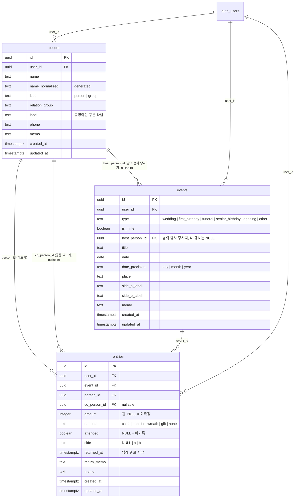

# 뿌린대로거두리라 — 1단계 데이터 모델

> 작성일 2026-09-14 · 작성 product-planner · 검토·보완 cto-orchestrator · **2026-09-15 클라우드 확정에 따라 CTO가 개정**
> 기준 — Supabase Postgres + RLS. 앱은 supabase-js로 테이블·뷰·RPC를 직접 호출하며 별도 API 서버는 없다. 금액은 integer(원). 모든 테이블은 UUID PK, `user_id`(소유 축), `created_at`/`updated_at`을 가진다. 기능 맥락은 docs/02.

## ✅ CTO 결정 사항

### 2026-09-15 개정 (저장 방식 로컬 → 클라우드)

| # | 항목 | 결정 | 근거 |
|---|---|---|---|
| 7 | 소유 축 | 세 테이블 모두 `user_id uuid NOT NULL REFERENCES auth.users ON DELETE CASCADE`, 기본값 `auth.uid()` | RLS의 기준 컬럼. 계정 삭제 시 데이터가 함께 지워진다(App Store 계정 삭제 요건) |
| 8 | 접근 제어 | 테이블마다 RLS 정책 4개(SELECT/INSERT/UPDATE/DELETE) 모두 `user_id = auth.uid()`. INSERT는 WITH CHECK, UPDATE는 USING과 WITH CHECK 둘 다 | UPDATE 정책이 빠지면 오류 없이 0건 처리된다(CTO 메모리 RLS 전례). 쓰기 정책 4개를 빠짐없이 둔다 |
| 9 | **소프트 삭제 제거** | `deleted_at`·tombstone·부분 인덱스·1회 업로드 방침을 전부 삭제. 물리 삭제 + FK `ON DELETE` 규칙 | 소프트 삭제는 "로컬 데이터를 나중에 서버로 올릴 때 삭제를 보존"하려는 장치였다. 서버가 처음부터 SoT이면 존재 이유가 없고, 모든 쿼리에 `deleted_at IS NULL`을 붙이는 비용만 남는다 |
| 10 | 이름 정규화 | `people.name_normalized`를 Postgres **generated column**으로 계산 | 앱이 계산해 보내던 값을 DB가 계산한다. 클라이언트 구현이 어긋날 여지가 없다 |
| 11 | 집계 | 사람별 수지는 `security_invoker` 뷰 1개, 통계는 RPC 함수 1개 | 앱에서 조인·GROUP BY를 조립하지 않는다. 뷰·함수는 호출자 권한으로 실행돼 RLS가 그대로 적용된다 |
| 12 | 삭제·병합 | `delete_person`·`merge_people` RPC 함수(security invoker) 2개로 원자적 처리 | 사람을 참조하는 축이 세 곳이라 클라이언트에서 순차 호출하면 중간 실패 시 반쪽 상태가 남는다 |
| 13 | 오프라인 | 읽기는 캐시 표시, 쓰기는 온라인 필수. 큐·동기화 없음 | 코디네이터 지시(단순함). 자세한 방침은 §7 |
| 14 | 가져오기 삭제 | JSON 내보내기만 남기고 가져오기·병합 규칙을 삭제 | 기기 변경은 로그인으로 해결된다. 가져오기의 유일한 용도였던 "기기 이전"이 사라졌다 |

### 2026-09-14 결정 (유지)

| # | 항목 | 결정 | 근거 |
|---|---|---|---|
| 1 | 공동 부조 컬럼 | `entries.co_person_id` 단일 nullable FK | 조인 테이블은 원장 조회마다 EXISTS가 붙는다. 3명 이상 봉투는 드물다 |
| 2 | 미확정 금액 | `entries.amount integer NULL` | NULL은 SUM에서 자동 제외돼 집계가 단순하다. 0원(부조 없음)과 의미가 분리된다 |
| 5 | `entries.direction` 없음 | 방향은 `events.is_mine`에서 파생 | 100% 파생되는 값을 컬럼으로 두면 행사 토글·기록 이동 시 조용히 어긋난다 |
| 6 | `events.host_person_id` | 남의 행사의 당사자 FK. 내 행사는 NULL | 미리 등록한 예정 행사(기록 0건)가 "기존 행사에 추가?" 판정에 잡혀야 한다 |

(3 tombstone 포함 내보내기, 4 앱 측 정규화 컬럼은 개정으로 폐기)

**금액 단위 규칙(구현 필수 조건)** — 앱 내부·DB·JSON의 금액 표현은 언제나 **원 단위 정수** 하나뿐이다. 금액 프리셋 "10만"과 키패드의 "만원 단위 토글"은 입력 컴포넌트 안에서만 ×10,000 변환을 수행하고, 도메인 함수·쿼리·RPC는 원 단위 값만 주고받는다.

## 1. 엔티티와 ERD

| 엔티티 | 역할 | 비고 |
|---|---|---|
| `auth.users` | Supabase Auth 사용자. 앱 테이블이 아니다 | 모든 행의 소유자. 계정 삭제 시 CASCADE |
| `people` | 나와 경조사를 주고받는 상대. 개인 또는 단체 | 원장의 축. 이름 UNIQUE 없음 |
| `events` | 경조사 행사 1건. 남의 행사(`is_mine = false`, 당사자 `host_person_id`)와 내 행사(`is_mine = true`) | `is_mine`은 "나 또는 우리 가족이 주최한 행사". 2단계 청첩장은 `is_mine = true`에만 붙는다 |
| `entries` | 기록 1건. 어떤 행사에서 어떤 사람과 얼마를 주고받았는가 | 방향은 `events.is_mine`에서 파생 |

앱 테이블은 세 개로 끝난다. 앱 설정(앱 잠금 여부 등 기기 종속 값)은 AsyncStorage, 사용자 설정이 필요해지면 `profiles` 테이블을 그때 만든다. 관계 그룹·행사 종류·부조 형태는 코드 상수(CHECK 제약)이며 테이블로 만들지 않는다.



## 2. 테이블별 컬럼 명세

공통 컬럼(세 테이블 모두)은 다음과 같다.

| 컬럼 | 타입 | 제약 | 설명 |
|---|---|---|---|
| `id` | uuid | PK, DEFAULT `gen_random_uuid()` | 앱이 생성해 보내도 되고(낙관적 UI용) 비워 두면 DB가 만든다 |
| `user_id` | uuid | NOT NULL, FK → auth.users ON DELETE CASCADE, DEFAULT `auth.uid()` | 소유자. 앱은 이 값을 보내지 않는다(기본값과 RLS가 채우고 검사한다) |
| `created_at` | timestamptz | NOT NULL, DEFAULT `now()` | |
| `updated_at` | timestamptz | NOT NULL, DEFAULT `now()` | 트리거 `set_updated_at`로 모든 UPDATE에서 갱신 |

### 2.1 `people`

| 컬럼 | 타입 | 제약 | 설명 |
|---|---|---|---|
| `name` | text | NOT NULL, CHECK 길이 1~50 | 표시 이름. 앱이 앞뒤 공백 제거 후 저장 |
| `name_normalized` | text | GENERATED ALWAYS AS (`lower(regexp_replace(normalize(name, NFC), '\s', '', 'g'))`) STORED | 검색·자동완성용. DB가 계산한다 |
| `kind` | text | NOT NULL, CHECK IN ('person','group'), DEFAULT 'person' | 개인/단체. 단체는 전화 필드를 UI에서 숨긴다 |
| `relation_group` | text | NOT NULL, CHECK IN ('family','relative','work','friend','acquaintance','other'), DEFAULT 'other' | 관계 그룹 6개 고정 |
| `label` | text | NULL, CHECK 길이 ≤ 30 | 동명이인 구분 라벨. 예 "회사 동기" |
| `phone` | text | NULL | 숫자·하이픈만. 형식 강제 없음 |
| `memo` | text | NULL, CHECK 길이 ≤ 500 | |

초안의 `contact_id`(기기 연락처 식별자)는 두지 않는다. 기기 종속 값을 서버에 두면 기기를 바꿀 때 의미가 없어진다. 연락처 피커는 이름·전화만 채운다.

### 2.2 `events`

| 컬럼 | 타입 | 제약 | 설명 |
|---|---|---|---|
| `type` | text | NOT NULL, CHECK IN ('wedding','first_birthday','funeral','senior_birthday','opening','other') | 결혼식·돌잔치·장례식·회갑/칠순·개업·기타 |
| `is_mine` | boolean | NOT NULL, DEFAULT false | true면 내 행사(받은돈). **기록이 1건이라도 있으면 변경 불가**(트리거 `events_lock_is_mine`) |
| `host_person_id` | uuid | NULL, FK → people ON DELETE SET NULL, CHECK (`is_mine` OR `host_person_id` IS NOT NULL) | 남의 행사의 당사자. 남의 행사는 필수, 내 행사는 NULL |
| `title` | text | NOT NULL, CHECK 길이 1~80 | 자동 생성 규칙은 남의 행사 "{당사자 이름} {종류 한글} {연도}", 내 행사 "내 {종류 한글}". 수정 가능 |
| `date` | date | NOT NULL | 정밀도가 month면 일을 01로, year면 월·일을 01-01로 채운다 |
| `date_precision` | text | NOT NULL, CHECK IN ('day','month','year'), DEFAULT 'day' | 표시·필터 시 참조 |
| `place` | text | NULL, CHECK 길이 ≤ 100 | |
| `side_a_label` | text | NULL, CHECK 길이 ≤ 20 | 내 행사의 측 A(예 "신랑측"). CHECK (`is_mine` OR `side_a_label` IS NULL) |
| `side_b_label` | text | NULL, CHECK 길이 ≤ 20 | CHECK (`side_b_label` IS NULL OR `side_a_label` IS NOT NULL) |
| `memo` | text | NULL, CHECK 길이 ≤ 500 | |

### 2.3 `entries`

| 컬럼 | 타입 | 제약 | 설명 |
|---|---|---|---|
| `event_id` | uuid | NOT NULL, FK → events ON DELETE CASCADE | 행사 삭제 시 기록 동반 삭제(docs/02 §5) |
| `person_id` | uuid | NOT NULL, FK → people ON DELETE CASCADE | 대표자(돈의 주인). 사람 삭제 시 기록 동반 삭제 |
| `co_person_id` | uuid | NULL, FK → people ON DELETE SET NULL, CHECK (`co_person_id` <> `person_id`) | 공동 부조자. 그 사람이 삭제되면 비워진다 |
| `amount` | integer | NULL, CHECK (`amount` >= 0) | 원 단위 정수. NULL = 미확정. 0 = 부조 없음 |
| `method` | text | NOT NULL, CHECK IN ('cash','transfer','wreath','gift','none'), DEFAULT 'cash' | |
| `attended` | boolean | NULL | 참석 여부. NULL = 미기록 |
| `side` | text | NULL, CHECK IN ('a','b') | 내 행사의 측 |
| `returned_at` | timestamptz | NULL | 답례 완료 시각. 내 행사 기록에서만 의미 있음 |
| `return_memo` | text | NULL, CHECK 길이 ≤ 200 | |
| `memo` | text | NULL, CHECK 길이 ≤ 500 | 대리 부조("김철수 편에 전달")는 여기 |

기록에는 날짜도 방향도 없다. 날짜는 `events.date`, 방향은 `events.is_mine`이다. 기록과 행사·사람의 `user_id`가 같아야 한다는 것은 RLS가 보장한다(다른 사용자의 행사 id를 넣어도 FK 대상 행이 RLS에 가려져 INSERT가 실패한다).

## 3. 정체성 축 — UNIQUE 제약과 인덱스

| 테이블 | 제약/인덱스 | 목적 |
|---|---|---|
| `people` | PK `id` | 사람의 정체성은 UUID뿐 |
| `people` | **UNIQUE 없음 on `name`** (의도적) | 동명이인 허용. 구별은 `label`·`relation_group`·이력으로 사용자가 한다 |
| `people` | INDEX `(user_id, name_normalized text_pattern_ops)` | 자동완성 prefix 검색 |
| `events` | INDEX `(user_id, date DESC)` | 행사 목록·다가오는 행사·기간 통계 |
| `events` | INDEX `(user_id, host_person_id)` | "기존 행사에 추가?" 판정, 사람의 행사 목록 |
| `entries` | INDEX `(user_id, person_id)`, `(user_id, co_person_id)`, `(user_id, event_id)`, `(user_id, created_at DESC)` | 원장·행사 상세·최근 기록 |

모든 인덱스는 `user_id`를 선두 컬럼으로 둔다. RLS가 모든 쿼리에 `user_id = auth.uid()`를 붙이기 때문이다.

사람을 참조하는 축은 세 곳(`entries.person_id`, `entries.co_person_id`, `events.host_person_id`)이다. 병합·삭제는 §6의 RPC 두 개가 세 곳을 함께 다룬다.

## 4. 접근 제어(RLS)

세 테이블 모두 `ALTER TABLE ... ENABLE ROW LEVEL SECURITY` 후 다음 네 정책을 동일하게 둔다.

```sql
CREATE POLICY people_select ON people FOR SELECT USING (user_id = auth.uid());
CREATE POLICY people_insert ON people FOR INSERT WITH CHECK (user_id = auth.uid());
CREATE POLICY people_update ON people FOR UPDATE USING (user_id = auth.uid()) WITH CHECK (user_id = auth.uid());
CREATE POLICY people_delete ON people FOR DELETE USING (user_id = auth.uid());
-- events, entries 동일
```

- `anon` 역할에는 아무 권한도 주지 않는다. 1단계에는 공개 데이터가 없다.
- 뷰(§5.1)는 `WITH (security_invoker = true)`, RPC 함수(§5.4, §6)는 `SECURITY INVOKER`(기본값)로 만들어 호출자의 RLS를 그대로 탄다. `SECURITY DEFINER`는 쓰지 않는다.
- 계정 삭제는 Edge Function `delete-account` 1개가 service role로 `auth.admin.deleteUser`를 호출하고, 앱 데이터는 FK CASCADE로 함께 지워진다. 앱은 이 함수 외에 service role을 절대 쓰지 않는다.

## 5. 핵심 조회

앱은 supabase-js로 아래를 호출한다. 조인·GROUP BY가 필요한 조회는 뷰와 RPC로 서버에 둔다.

### 5.1 뷰 `person_balances` — 사람 목록·원장 상단 카드

```sql
CREATE VIEW person_balances WITH (security_invoker = true) AS
SELECT
  p.id, p.user_id, p.name, p.label, p.relation_group, p.kind,
  COALESCE(SUM(en.amount) FILTER (WHERE NOT e.is_mine), 0)  AS given_total,
  COALESCE(SUM(en.amount) FILTER (WHERE e.is_mine), 0)      AS received_total,
  COALESCE(SUM(en.amount) FILTER (WHERE NOT e.is_mine), 0)
    - COALESCE(SUM(en.amount) FILTER (WHERE e.is_mine), 0)  AS balance,
  COUNT(en.id) FILTER (WHERE NOT e.is_mine AND en.amount IS NULL) AS given_unconfirmed,
  COUNT(en.id) FILTER (WHERE e.is_mine AND en.amount IS NULL)     AS received_unconfirmed,
  COUNT(en.id)          AS entry_count,
  MAX(en.created_at)    AS last_entry_at
FROM people p
LEFT JOIN entries en ON en.person_id = p.id OR en.co_person_id = p.id
LEFT JOIN events  e  ON e.id = en.event_id
GROUP BY p.id;
```

공동 부조는 `person_id OR co_person_id`로 두 사람 모두에 전액 잡힌다(docs/02 §5). `balance`가 양수면 "내가 더 줌".

### 5.2 원장 목록(사람 상세)

```
entries?select=*,event:events(title,type,is_mine,date,date_precision),co_person:people!co_person_id(name)
        &or=(person_id.eq.{id},co_person_id.eq.{id})
        &order=event(date).desc,created_at.desc
```

`co_person_id = {id}`인 행은 "공동" 배지. 방향은 `event.is_mine`.

### 5.3 행사별 합계(행사 상세 상단)

```sql
-- RPC: event_summary(p_event_id uuid)
SELECT side, method,
       COUNT(*) AS cnt, SUM(amount) AS total,
       COUNT(*) FILTER (WHERE amount IS NULL)         AS unconfirmed,
       COUNT(*) FILTER (WHERE returned_at IS NOT NULL) AS returned
FROM entries
WHERE event_id = p_event_id
GROUP BY side, method;
```

앱은 결과를 메모리에서 전체·측별·형태별로 접는다.

### 5.4 RPC `stats_by_year(p_year int)` — 통계 화면

```sql
SELECT extract(year FROM e.date)::int AS year,
       e.is_mine, e.type, p.relation_group,
       COUNT(*) AS cnt, SUM(en.amount) AS total
FROM entries en
JOIN events e ON e.id = en.event_id
JOIN people p ON p.id = en.person_id
WHERE p_year IS NULL OR extract(year FROM e.date) = p_year
GROUP BY 1, 2, 3, 4;
```

관계 그룹은 대표자(`person_id`) 기준으로 한 번만 센다. 연도는 `date_precision`과 무관하게 `date`의 연도로 묶으므로 "연도만 아는 기록"도 포함된다. 사람별 상위 10은 `person_balances`를 `balance` 정렬로 두 번 조회한다.

### 5.5 이름 자동완성

```
person_balances?select=id,name,label,relation_group,kind,last_entry_at
               &name_normalized=like.{prefix}*
               &order=last_entry_at.desc.nullslast,name_normalized&limit=8
```

`{prefix}`는 앱이 DB와 같은 규칙(NFC·공백 제거·소문자)으로 정규화한다. 뷰에 `name_normalized`를 포함시킨다. 입력이 비어 있을 때의 "최근 사람 5명"은 `entries`를 `created_at DESC`로 읽어 `person_id`를 DISTINCT로 5개 뽑는다. 초성 검색은 1단계 범위 밖이다.

### 5.6 최근 기록(홈)

```
entries?select=id,amount,method,side,person:people!person_id(name),co_person:people!co_person_id(name),event:events(title,type,is_mine,date,date_precision)
        &order=created_at.desc&limit=10
```

### 5.7 빠른 기록 저장 시 "기존 행사에 추가?" 판정

```
events?select=id,title,date
      &is_mine=eq.false&host_person_id=eq.{person_id}&type=eq.{type}
      &date=gte.{date-7d}&date=lte.{date+7d}
      &order=date&limit=3
```

앱이 날짜 차이가 가장 작은 행을 고른다. `host_person_id`로 판정하므로 미리 등록한 예정 행사(기록 0건)도 잡힌다.

## 6. 삭제·병합 RPC

```sql
-- 사람 삭제. entries.person_id는 CASCADE, co_person_id·host_person_id는 SET NULL이 처리한다.
-- 그 사람이 당사자였고 기록이 없어진 남의 행사만 추가로 지운다.
CREATE FUNCTION delete_person(p_id uuid) RETURNS void LANGUAGE plpgsql AS $$
BEGIN
  DELETE FROM people WHERE id = p_id;           -- RLS: 내 것만 지워진다
  DELETE FROM events e
   WHERE e.user_id = auth.uid() AND NOT e.is_mine AND e.host_person_id IS NULL
     AND NOT EXISTS (SELECT 1 FROM entries en WHERE en.event_id = e.id);
END $$;

-- 사람 병합. victim의 세 참조 축을 survivor로 옮기고 victim을 지운다.
CREATE FUNCTION merge_people(p_victim uuid, p_survivor uuid) RETURNS void LANGUAGE plpgsql AS $$
BEGIN
  IF EXISTS (SELECT 1 FROM entries
              WHERE (person_id = p_victim AND co_person_id = p_survivor)
                 OR (person_id = p_survivor AND co_person_id = p_victim)) THEN
    RAISE EXCEPTION 'merge_would_self_reference';   -- 부부를 하나로 합치려는 경우
  END IF;
  UPDATE entries SET person_id    = p_survivor WHERE person_id    = p_victim;
  UPDATE entries SET co_person_id = p_survivor WHERE co_person_id = p_victim;
  UPDATE events  SET host_person_id = p_survivor WHERE host_person_id = p_victim;
  DELETE FROM people WHERE id = p_victim;
END $$;
```

두 함수 모두 `SECURITY INVOKER`라 RLS가 적용된다. **UPDATE 문이 RLS에 걸려 0건이 되어도 오류가 나지 않으므로**, 병합 후 앱은 `survivor`의 `person_balances.entry_count`가 두 사람 합과 같은지 확인한다(docs/02 §7 검증 기준).

## 7. 오프라인 시 동작 방침

- **읽기** — TanStack Query 캐시를 AsyncStorage에 영속화(`persistQueryClient`)한다. 앱을 오프라인에서 열어도 마지막으로 본 홈·사람·행사 화면이 표시되고 상단에 "오프라인 · 마지막 갱신 {시각}" 배너가 뜬다.
- **쓰기** — 온라인 필수. 저장 실패 시 입력 시트를 닫지 않고 폼 값을 그대로 유지한 채 "저장하지 못했습니다 · 다시 시도" 버튼을 보여 준다. 사용자가 시트를 닫으면 입력은 버려진다.
- **하지 않는 것** — 오프라인 쓰기 큐, 로컬 DB, 충돌 해결, 실시간 구독. 같은 계정을 두 기기에서 동시에 쓰면 마지막 쓰기가 이긴다(행 단위 덮어쓰기).
- 💡 이 방침의 대가는 "식장 가는 지하철에서 기록"이 네트워크 상태에 좌우된다는 점이다. 필요가 증명되면 "미전송 기록 1건 로컬 보관 후 재시도"를 후속 릴리스 후보로 둔다(docs/01 3단계 후보).

## 8. SQL 마이그레이션 초안

```sql
-- supabase/migrations/0001_init.sql — 1단계 스키마(people · events · entries)
CREATE TABLE people (
  id               uuid PRIMARY KEY DEFAULT gen_random_uuid(),
  user_id          uuid NOT NULL DEFAULT auth.uid() REFERENCES auth.users(id) ON DELETE CASCADE,
  name             text NOT NULL CHECK (char_length(name) BETWEEN 1 AND 50),
  name_normalized  text GENERATED ALWAYS AS (lower(regexp_replace(normalize(name, NFC), '\s', '', 'g'))) STORED,
  kind             text NOT NULL DEFAULT 'person' CHECK (kind IN ('person','group')),
  relation_group   text NOT NULL DEFAULT 'other'
                   CHECK (relation_group IN ('family','relative','work','friend','acquaintance','other')),
  label            text CHECK (char_length(label) <= 30),
  phone            text,
  memo             text CHECK (char_length(memo) <= 500),
  created_at       timestamptz NOT NULL DEFAULT now(),
  updated_at       timestamptz NOT NULL DEFAULT now()
);

CREATE TABLE events (
  id               uuid PRIMARY KEY DEFAULT gen_random_uuid(),
  user_id          uuid NOT NULL DEFAULT auth.uid() REFERENCES auth.users(id) ON DELETE CASCADE,
  type             text NOT NULL CHECK (type IN ('wedding','first_birthday','funeral','senior_birthday','opening','other')),
  is_mine          boolean NOT NULL DEFAULT false,
  host_person_id   uuid REFERENCES people(id) ON DELETE SET NULL,
  title            text NOT NULL CHECK (char_length(title) BETWEEN 1 AND 80),
  date             date NOT NULL,
  date_precision   text NOT NULL DEFAULT 'day' CHECK (date_precision IN ('day','month','year')),
  place            text CHECK (char_length(place) <= 100),
  side_a_label     text CHECK (char_length(side_a_label) <= 20),
  side_b_label     text CHECK (char_length(side_b_label) <= 20),
  memo             text CHECK (char_length(memo) <= 500),
  created_at       timestamptz NOT NULL DEFAULT now(),
  updated_at       timestamptz NOT NULL DEFAULT now(),
  CHECK (is_mine OR host_person_id IS NOT NULL),
  CHECK (is_mine OR side_a_label IS NULL),
  CHECK (side_b_label IS NULL OR side_a_label IS NOT NULL)
);

CREATE TABLE entries (
  id               uuid PRIMARY KEY DEFAULT gen_random_uuid(),
  user_id          uuid NOT NULL DEFAULT auth.uid() REFERENCES auth.users(id) ON DELETE CASCADE,
  event_id         uuid NOT NULL REFERENCES events(id) ON DELETE CASCADE,
  person_id        uuid NOT NULL REFERENCES people(id) ON DELETE CASCADE,
  co_person_id     uuid REFERENCES people(id) ON DELETE SET NULL,
  amount           integer CHECK (amount >= 0),
  method           text NOT NULL DEFAULT 'cash' CHECK (method IN ('cash','transfer','wreath','gift','none')),
  attended         boolean,
  side             text CHECK (side IN ('a','b')),
  returned_at      timestamptz,
  return_memo      text CHECK (char_length(return_memo) <= 200),
  memo             text CHECK (char_length(memo) <= 500),
  created_at       timestamptz NOT NULL DEFAULT now(),
  updated_at       timestamptz NOT NULL DEFAULT now(),
  CHECK (co_person_id IS NULL OR co_person_id <> person_id)
);

CREATE INDEX people_name_idx        ON people  (user_id, name_normalized text_pattern_ops);
CREATE INDEX events_date_idx        ON events  (user_id, date DESC);
CREATE INDEX events_host_idx        ON events  (user_id, host_person_id);
CREATE INDEX entries_person_idx     ON entries (user_id, person_id);
CREATE INDEX entries_co_person_idx  ON entries (user_id, co_person_id);
CREATE INDEX entries_event_idx      ON entries (user_id, event_id);
CREATE INDEX entries_created_idx    ON entries (user_id, created_at DESC);

-- updated_at 트리거, events_lock_is_mine 트리거, RLS 정책(§4), 뷰(§5.1), RPC(§5.3, §5.4, §6)는 같은 파일에 이어서 둔다.
```

타입은 `supabase gen types typescript`로 생성해 앱의 `src/db/database.types.ts`에 둔다. 손으로 쓴 타입은 두지 않는다.

## 9. 2단계 확장 영향 검토

### 9.1 추가되는 테이블(2단계, 같은 Supabase 프로젝트)

| 테이블 | 핵심 컬럼 | 1단계 테이블과의 관계 |
|---|---|---|
| `invitations` | `id`, `user_id`, `event_id` → events(is_mine), `slug` UNIQUE(공개 URL), `template`, `content` jsonb, `published_at`, `expires_at` | 이벤트 1 : 청첩장 0..1. 공개 페이지는 `anon` 역할에 `published_at IS NOT NULL` 조건의 SELECT 정책만 연다. 1단계에서 처음으로 `anon` 정책이 생기는 지점 |
| `rsvps` | `id`, `invitation_id`, `guest_name`, `guest_phone`, `side` ('a'/'b'), `attending`, `headcount`, `message`, `linked_person_id` → people(nullable) | 하객 회신(`anon` INSERT 허용). 주인이 사람으로 승격하면 `linked_person_id`가 채워진다. `side` 값 체계가 1단계와 같다 |
| `bank_accounts` | `id`, `user_id`, `event_id`, `side`, `bank_name`, `account_number`, `holder_name`, `sort_order` | 축의금 계좌 안내. 측별 여러 계좌 |

### 9.2 1단계 테이블 변경

없다. `user_id`·RLS·UUID·`is_mine`·`side`가 모두 1단계부터 있으므로 2단계는 테이블 3개를 더하는 일로 끝난다. 초안에 있던 "로컬 → 서버 1회 업로드 마이그레이션"은 서버가 처음부터 SoT가 되면서 통째로 사라졌다. 이것이 클라우드 선택의 가장 큰 이득이다.

### 9.3 이후 후보 "가족 공동 장부"에 대한 경고

부부가 한 원장을 함께 쓰려면 소유 축이 `user_id`(사람)에서 `ledger_id`(장부) + 구성원 테이블로 넓어진다. 이때 **세 테이블의 RLS 정책 12개와 RPC 3개를 전부 다시 써야 하고**, 정책이 하나라도 빠지면 오류 없이 0건 처리된다(CTO 메모리 전례). 1단계에 `ledger_id`를 미리 넣는 것은 추측성 설계라 하지 않는다. 대신 사용자 확인 질문(docs/02 §8 11번)으로 "공동 관리가 1단계 필수인가"를 묻고, 필수라면 착수 전에 소유 축을 `ledger_id`로 바꾼다. 착수 후에 바꾸는 것보다 착수 전에 바꾸는 것이 압도적으로 싸다.

## 10. JSON 내보내기 포맷 초안 (P1, 내보내기 전용)

```json
{
  "format": "ppurin-export",
  "version": 1,
  "exported_at": "2026-09-15T03:21:07.123Z",
  "app_version": "1.0.0",
  "counts": { "people": 120, "events": 45, "entries": 380 },
  "data": {
    "people":  [ { "id": "…", "name": "김철수", "kind": "person", "relation_group": "work", "label": "회사 동기", "phone": null, "memo": null, "created_at": "…", "updated_at": "…" } ],
    "events":  [ { "id": "…", "type": "wedding", "is_mine": false, "host_person_id": "…", "title": "김철수 결혼식 2025", "date": "2025-05-18", "date_precision": "day", "place": null, "side_a_label": null, "side_b_label": null, "memo": null, "created_at": "…", "updated_at": "…" } ],
    "entries": [ { "id": "…", "event_id": "…", "person_id": "…", "co_person_id": null, "amount": 100000, "method": "cash", "attended": true, "side": null, "returned_at": null, "return_memo": null, "memo": null, "created_at": "…", "updated_at": "…" } ]
  }
}
```

- 용도는 사용자가 자기 데이터를 파일로 보관하는 것(개인정보 이동권)이다. 가져오기는 없다.
- `user_id`와 `name_normalized`는 내보내지 않는다. 컬럼명은 snake_case, 금액은 JSON number(정수).

## 📋 CTO 보고 요약

- 테이블은 `people`·`events`·`entries` 셋뿐이며 모두 `user_id` 소유 축과 RLS 정책 4개를 가진다. 열거값은 CHECK 제약, 이름 정규화는 generated column이다.
- 클라우드 확정으로 소프트 삭제·tombstone·1회 업로드·JSON 가져오기가 전부 사라져 초안보다 단순해졌다. 삭제는 물리 삭제 + FK 규칙, 사람 삭제·병합은 RPC 2개로 원자 처리한다.
- 관례 처리는 유지 — 공동 부조 `co_person_id`, 단체 `people.kind`, 미확정 `amount NULL`, 날짜 불명 `date_precision`, 양가 `side_a/b_label` + `entries.side`. 방향은 `events.is_mine`에서 파생, 남의 행사 당사자는 `host_person_id`.
- 집계는 뷰 `person_balances`와 RPC `event_summary`·`stats_by_year`로 서버에 둔다. 오프라인은 읽기 캐시만, 쓰기는 온라인 필수.
- 2단계는 같은 프로젝트에 `invitations`·`rsvps`·`bank_accounts`를 더하면 끝난다. 가족 공동 장부는 소유 축이 바뀌는 큰 변경이라 1단계 필수 여부를 사용자에게 묻는다.
